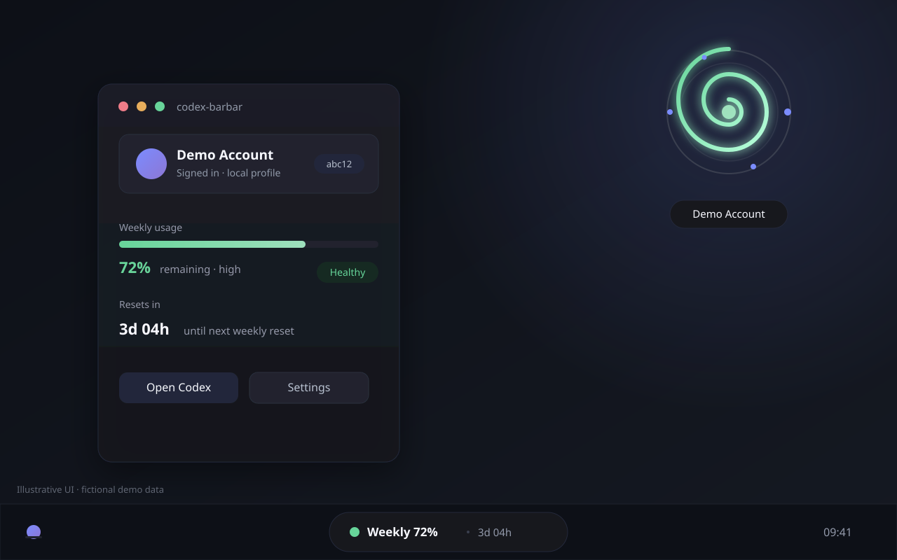
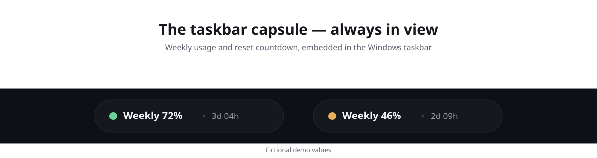
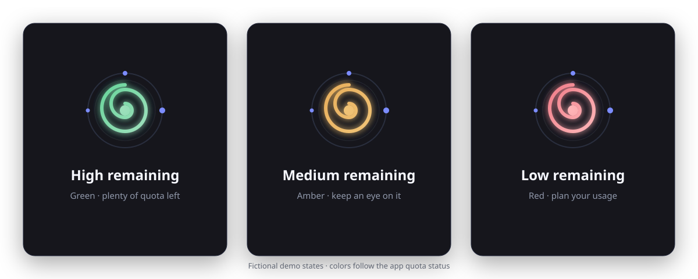
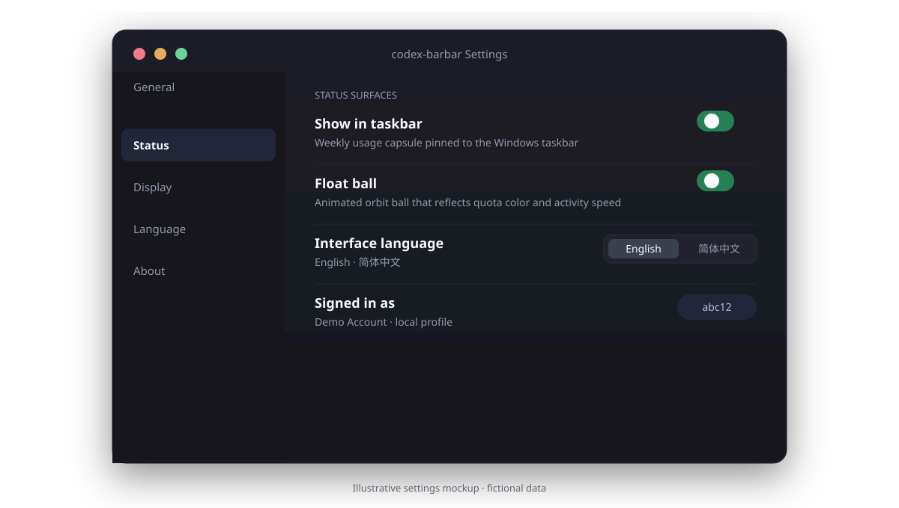
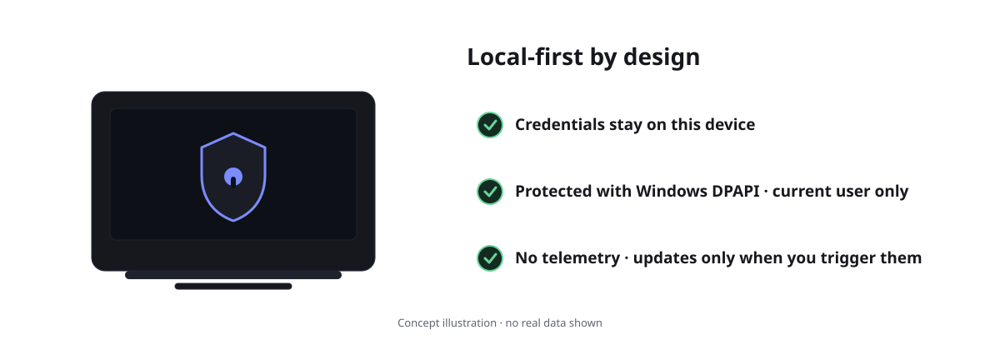

# codex-barbar

[English](README.md) · [简体中文](README.zh-CN.md)

**Your Codex usage, at a glance — right in the Windows taskbar.**

codex-barbar is a small Windows tray application that shows your Codex weekly usage and reset countdown without opening anything. It reads data through the official Codex App Server protocol, keeps credentials on your machine, and gets out of your way.

*Illustrative UI mockup · all values shown are fictional demo data.*

## Highlights

### Taskbar capsule
A compact, always-visible capsule in the Windows taskbar shows weekly usage and the reset countdown at a glance. Fully optional — turn it off in Settings.

### Animated float ball
An always-on-top orbit ball that spins continuously. Color reflects remaining quota (green · high, amber · medium, red · low) and speed reflects activity (idle, thinking ×2, fast ×3). Optional, with adjustable opacity and glow.

### macOS-inspired settings
Rounded glass panels, quiet spacing, and clear toggles — a clean macOS-style feel on Windows 11.

### Local-first by design
Credentials stay on this device, protected with Windows DPAPI (current user). No telemetry. Updates are only checked when you trigger them.

## Quick Start

**Requirements**

- Windows 11 23H2 or newer, x64
- WebView2 Runtime (preinstalled on current Windows 11)
- A working [Codex](https://developers.openai.com/codex/) installation, signed in with the Codex CLI (`codex login`)

**Install**

Download the latest release from GitHub Releases:

- Installer: `codex-barbar_<version>_x64-setup.exe` (per-user NSIS install, no administrator elevation)
- Portable: `codex-barbar_<version>_x64-portable.zip`

Binaries are unsigned until an Authenticode certificate is provided, so SmartScreen may show a warning. Verify downloads against `SHA256SUMS.txt` from the same release before running.

**First run**

1. Start codex-barbar; it stays in the system tray.
2. Click the tray icon to open the usage panel.
3. If the panel shows “Not signed in”, run `codex login` in a terminal and refresh.
4. The taskbar capsule and float ball are enabled by default for new installs; both can be turned off in Settings.

Your data is stored under `%LOCALAPPDATA%\codex-barbar` (including the portable build). To remove all accounts and cache, close the app and delete that directory, or use the uninstaller’s explicit “Delete local codex-barbar accounts and cache?” confirmation.

**Settings**

- **General** — start at login, taskbar status, float ball, opacity, refresh interval, display mode, theme, language
- **Accounts** — manage signed-in Codex accounts
- **Advanced** — Codex executable path validation and diagnostics export
- **About** — version and update check

Usage refreshes on a configurable interval (default 5 minutes) and may lag behind the live account; click Refresh in the panel for the latest numbers.

## What it does and does not do

- Codex only. No other provider, browser-cookie import, API-key account, or usage notification surface is included.
- Reads usage through the official but experimental `codex app-server` stdio JSONL protocol. `experimentalApi` stays disabled; private `/wham/*` calls are removed.
- The current CLI profile is read-only. codex-barbar never logs in, logs out, switches, or deletes accounts on your behalf.
- Managed profiles use an isolated `CODEX_HOME`, force file credential storage, and protect credentials with Windows DPAPI (Current User only).
- No telemetry. Startup never checks for, downloads, or applies updates; you trigger update checks manually from the UI.

## Development

See [docs/BUILDING.md](docs/BUILDING.md) for prerequisites and commands, and [docs/ARCHITECTURE.md](docs/ARCHITECTURE.md) for the module layout. Stack: Tauri 2, React 18 / Vite, Rust, `pnpm@10.18.1`.

## Privacy and support

- [PRIVACY.md](PRIVACY.md) — what is stored, where, and the threat boundary
- [TROUBLESHOOTING.md](TROUBLESHOOTING.md) — error states and recovery steps
- [docs/TESTED_CODEX_VERSIONS.md](docs/TESTED_CODEX_VERSIONS.md) — tested Codex version limits

## Upstream provenance

codex-barbar is a Windows port of [CodexBar](https://github.com/steipete/CodexBar). The audited source record and frozen baseline are documented in [UPSTREAMS.md](UPSTREAMS.md) and [docs/architecture/V1_BASELINE.md](docs/architecture/V1_BASELINE.md).

## License

MIT. See [LICENSE](LICENSE).