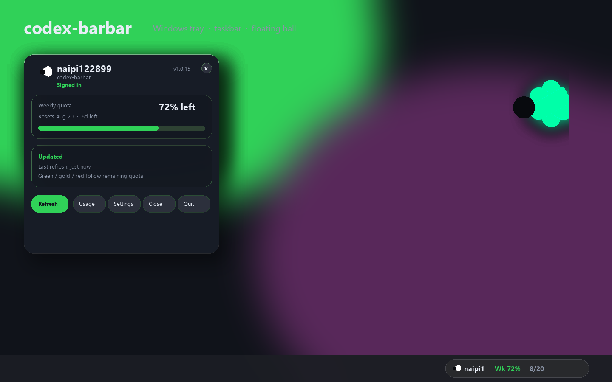
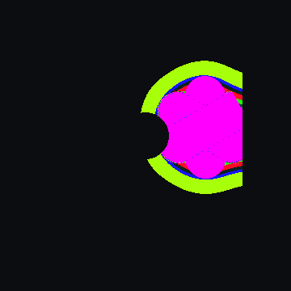
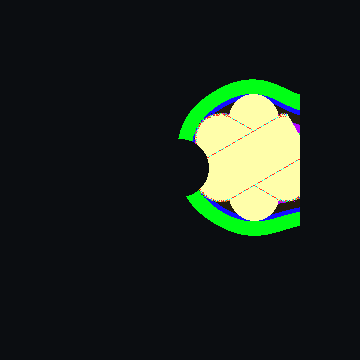
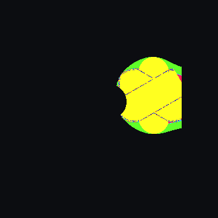
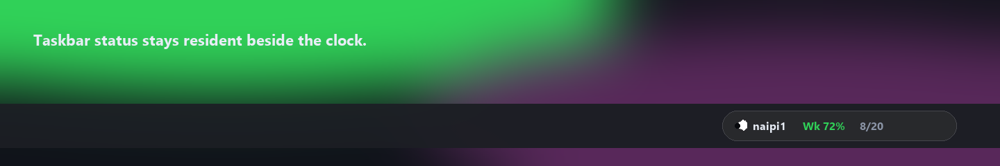

# codex-barbar

> **English** | [中文](README.zh-CN.md)

**A Windows tray app that shows your Codex usage and limits at a glance.**



<p align="center">
  
  
  
</p>

<p align="center">
  
</p>

The floating ball stays icon-sized and clockwise. Color shows remaining quota
(green / gold / red). Speed shows activity: idle, thinking ×2, Fast ×3.

codex-barbar is a Windows 11 x64 tray application for tracking your
[Codex](https://developers.openai.com/codex/) usage and quota limits. It
talks to the official Codex App Server protocol, keeps credentials local,
and shows live quota in your tray, taskbar, and a floating ball.

## Features

- Tray panel with account, quota, reset time, and manual refresh
- Taskbar status overlay (optional, opacity adjustable)
- Floating status ball (optional) with green / yellow / red quota colors
- Auto refresh on a configurable interval (default 5 minutes)
- Shows the real OpenAI account name (not "current cli")
- Weekly quota with reset countdown
- Per-user install, no admin required
- No telemetry; credentials stay local (DPAPI protected)

## Quick Start

1. Go to [Releases](https://github.com/naipi11/codex-barbar/releases/latest).
2. Download the installer `codex-barbar_<version>_x64-setup.exe` (recommended) or the portable `codex-barbar.exe`.
3. Run the installer (per-user, no admin needed) or launch the portable exe.
4. The app starts in the system tray. Click the tray icon to open the usage panel.
5. If it shows **Not signed in**, run `codex login` in a terminal, then click **Refresh** in the panel.
6. Open **Settings → General** to enable the taskbar status bar and the floating ball (both are on by default for new installs).

## Requirements

- Windows 11 x64 (23H2 or newer)
- A working [Codex](https://developers.openai.com/codex/) installation signed in with `codex login`

## First Run

Your data is stored under `%LOCALAPPDATA%\codex-barbar`. To remove all
accounts and cache, close the app and delete that directory, or use the
uninstaller's confirmation prompt.

## Settings

- **General** — start at login, taskbar status, floating ball, opacity, refresh interval, display mode, theme, language
- **Accounts** — manage signed-in Codex accounts
- **Advanced** — Codex executable path validation and diagnostics export
- **About** — version and update check

## Data & Privacy

- Reads usage through the official but experimental `codex app-server` stdio JSONL protocol. `experimentalApi` stays disabled; private `/wham/*` calls are removed.
- Managed profiles use an isolated `CODEX_HOME`, force file credential storage, and protect credentials with Windows DPAPI (Current User only).
- The current CLI profile is read-only. codex-barbar never logs in, logs out, switches, or deletes accounts on your behalf.
- No telemetry. Startup never checks for, downloads, or applies updates; you trigger update checks manually from the UI.

## Development

```text
# Rust backend / CLI
cargo test --manifest-path rust/Cargo.toml
cargo clippy --manifest-path rust/Cargo.toml --all-targets -- -D warnings

# Tauri shell crate
cargo test --manifest-path apps/desktop-tauri/src-tauri/Cargo.toml
cargo clippy --manifest-path apps/desktop-tauri/src-tauri/Cargo.toml --all-targets -- -D warnings

# Frontend (use pnpm)
pnpm --dir apps/desktop-tauri install
pnpm --dir apps/desktop-tauri test
pnpm --dir apps/desktop-tauri run tauri:build
```

See [docs/BUILDING.md](docs/BUILDING.md) and [docs/ARCHITECTURE.md](docs/ARCHITECTURE.md).

## Docs

- [PRIVACY.md](PRIVACY.md) — what is stored, where, and the threat boundary
- [TROUBLESHOOTING.md](TROUBLESHOOTING.md) — error states and recovery steps
- [docs/TESTED_CODEX_VERSIONS.md](docs/TESTED_CODEX_VERSIONS.md) — tested Codex version limits
- [CHANGELOG.md](CHANGELOG.md) — release history

## Upstream

codex-barbar is a Windows port of [CodexBar](https://github.com/steipete/CodexBar).
The audited source record and frozen baseline are documented in
[UPSTREAMS.md](UPSTREAMS.md).

## License

MIT — see [LICENSE](LICENSE).
