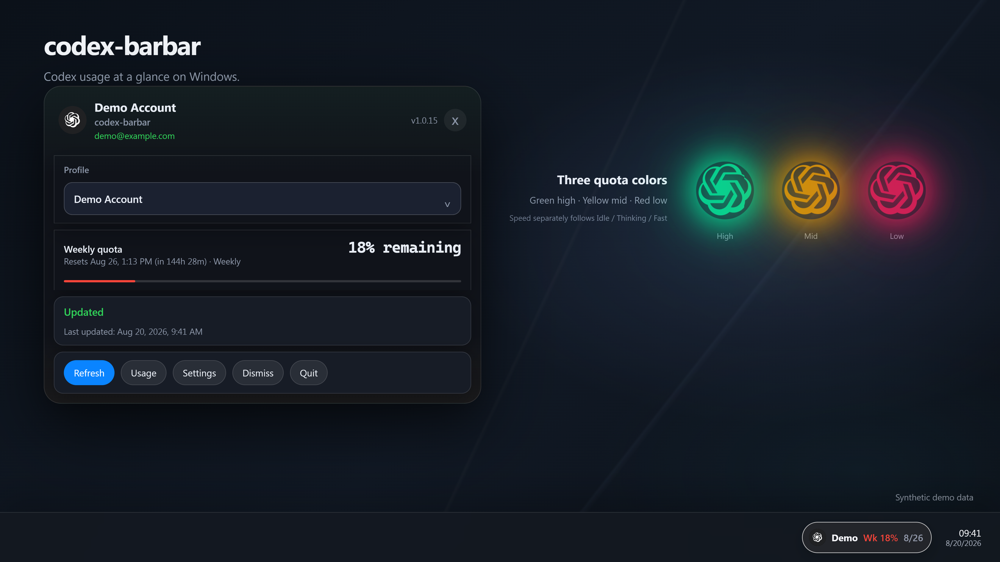
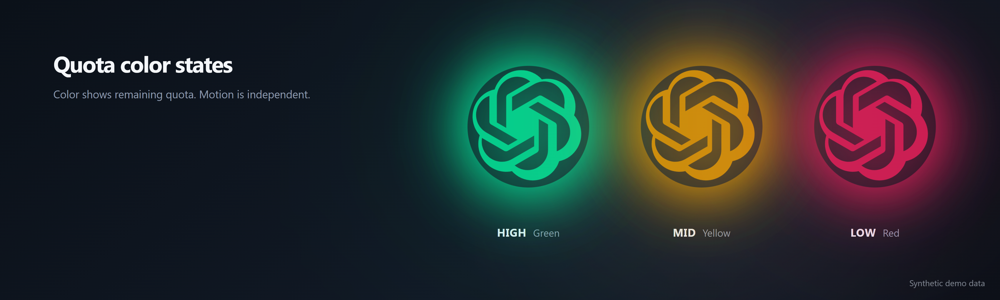
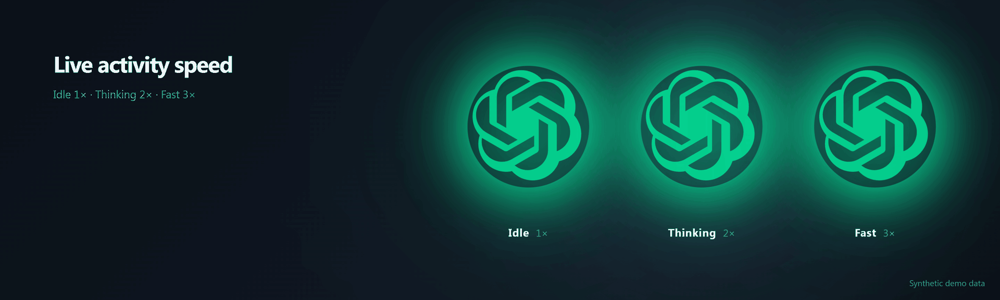
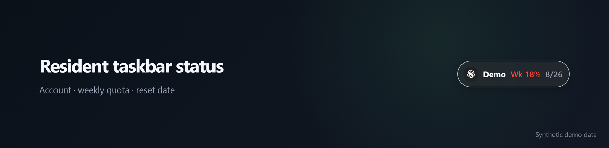

<div align="center">
  
  <h1>codex-barbar</h1>
  <p><strong>A Windows tray app; Ubuntu 24.04 amd64 is a release target pending desktop acceptance.</strong></p>
  <p><strong>English</strong> · <a href="README.zh-CN.md">中文</a></p>
</div>

<p align="center">
  <a href="https://github.com/naipi11/codex-barbar/releases/latest"></a>
  <a href="https://github.com/naipi11/codex-barbar/actions/workflows/pr-check.yml"></a>
  <a href="https://github.com/naipi11/codex-barbar/releases"></a>
  <a href="https://github.com/naipi11/codex-barbar/stargazers"></a>
  <a href="LICENSE"></a>
</p>

<p align="center">
  
  
  
  
  
</p>

The floating ball stays icon-sized and clockwise. Color shows remaining quota
(green / gold / red). Speed shows activity: idle, thinking ×2, Fast ×3.

codex-barbar is a Windows 11 x64 tray application for tracking your
[Codex](https://developers.openai.com/codex/) usage and quota limits. It
talks to the official Codex App Server protocol, keeps credentials local, and
shows live quota in your tray and a floating ball. Ubuntu 24.04 amd64 is a
Debian release target in preview, pending desktop acceptance; it is not yet a
supported release platform. The Windows taskbar status surface is Windows-only.
See [Linux acceptance](docs/LINUX_ACCEPTANCE.md) before treating a Debian
asset as release-ready.



_Rendered from the current React/CSS components. Every account name, date,
and quota value in the showcase is synthetic demo data._

## Visual Tour

### Quota color states



- Green: 67–100% remaining
- Yellow: 34–66% remaining
- Red: 0–33% remaining

### Activity motion



Color and speed are independent. Color shows remaining quota; clockwise
rotation shows activity: **Idle 1×**, **Thinking 2×**, **Fast 3×**.

### Resident taskbar status



## Star History

[](https://star-history.com/#naipi11/codex-barbar&Date)

## Features

- Tray panel with account, quota, reset time, and manual refresh
- Taskbar status overlay (Windows only; optional, opacity adjustable)
- Floating status ball (optional) with green / yellow / red quota colors
- Clockwise activity animation: Idle 1×, Thinking 2×, Fast 3×
- Auto refresh on a configurable interval (default 5 minutes)
- Shows the real OpenAI account name (not "current cli")
- Weekly quota with reset countdown
- Per-user Windows install, no admin required
- No telemetry; credentials stay local (Windows uses DPAPI; Linux release
  acceptance requires Secret Service with no plaintext fallback)

## Quick Start

### Windows 11 x64

1. Go to [Releases](https://github.com/naipi11/codex-barbar/releases/latest).
2. Download `codex-barbar_<version>_x64-setup.exe` (recommended) or `codex-barbar_<version>_x64-portable.zip`.
3. Run the installer (per-user, no admin needed) or extract and launch the portable build.
4. The app starts in the system tray. Click the tray icon to open the usage panel.
5. If it shows **Not signed in**, run `codex login` in a terminal, then click **Refresh** in the panel.
6. Open **Settings → General** to configure the taskbar status and floating ball. New installs enable **Start at login** and the floating ball; the taskbar status is optional and off by default.

### Ubuntu 24.04 amd64 (desktop acceptance pending)

The current planned Debian asset is `codex-barbar_1.1.0_amd64.deb`. Do not
infer that it has been published or accepted from this filename: release
publication requires the completed record in
[docs/verification/linux/ubuntu-24.04-acceptance.md](docs/verification/linux/ubuntu-24.04-acceptance.md)
and green Windows and Ubuntu CI.

1. Get the matching `codex-barbar_<version>_amd64.deb` from the release you
   have verified.
2. Install it with APT so its declared WebKitGTK, GTK, AppIndicator, and
   Secret Service dependencies are resolved:

   ```bash
   sudo apt install ./codex-barbar_1.1.0_amd64.deb
   ```

3. Start the app with `codex-barbar`, then use the tray icon to open the
   panel. If it shows **Not signed in**, run `codex login` and refresh.
4. GNOME is the primary desktop target. KDE is best effort: its panel and
   AppIndicator integration can differ. Test both Wayland and X11 when they
   are available; on Wayland the floating ball is a normal draggable window
   and compositor policy can limit its placement or always-on-top behavior.

## Requirements

- Windows 11 x64 (23H2 or newer)
- A working [Codex](https://developers.openai.com/codex/) installation signed in with `codex login`
- Ubuntu 24.04 amd64 for the Debian target, with a working GNOME/KDE tray or
  AppIndicator implementation. The package declares `libwebkit2gtk-4.1-0`,
  `libgtk-3-0`, `libayatana-appindicator3-1`, and `libsecret-1-0`.

## First Run

Your data is stored under `%LOCALAPPDATA%\codex-barbar`. To remove all
accounts and cache, close the app and delete that directory, or use the
uninstaller's confirmation prompt.

## Settings

- **General** — start at login, taskbar status, floating ball, opacity, refresh interval, display mode, theme, language
- **Accounts** — manage signed-in Codex accounts
- **Advanced** — Codex executable path validation and diagnostics export
- **About** — version and update check

## Data & Privacy

- Reads usage through the official but experimental `codex app-server` stdio JSONL protocol. `experimentalApi` stays disabled; private `/wham/*` calls are removed.
- Managed profiles use an isolated `CODEX_HOME`, force file credential storage, and protect credentials with Windows DPAPI (Current User only).
- On Linux, managed credentials must be stored in the desktop Secret Service;
  the on-disk vault is only a `codex-barbar-secret-service:v1:<profile-uuid>`
  marker. A locked or unavailable Secret Service is an error, never a
  plaintext credential fallback. This remains an acceptance requirement until
  recorded on a real Ubuntu desktop.
- The current CLI profile is read-only. codex-barbar never logs in, logs out, switches, or deletes accounts on your behalf.
- No telemetry. Startup never checks for, downloads, or applies updates; you trigger update checks manually from the UI.

## Development

```text
# Rust backend / CLI
cargo test --manifest-path rust/Cargo.toml
cargo clippy --manifest-path rust/Cargo.toml --all-targets -- -D warnings

# Tauri shell crate
cargo test --manifest-path apps/desktop-tauri/src-tauri/Cargo.toml
cargo clippy --manifest-path apps/desktop-tauri/src-tauri/Cargo.toml --all-targets -- -D warnings

# Frontend (use pnpm)
pnpm --dir apps/desktop-tauri install
pnpm --dir apps/desktop-tauri test
pnpm --dir apps/desktop-tauri run tauri:build
```

See [docs/BUILDING.md](docs/BUILDING.md) and [docs/ARCHITECTURE.md](docs/ARCHITECTURE.md).

## Docs

- [PRIVACY.md](PRIVACY.md) — what is stored, where, and the threat boundary
- [TROUBLESHOOTING.md](TROUBLESHOOTING.md) — error states and recovery steps
- [docs/TESTED_CODEX_VERSIONS.md](docs/TESTED_CODEX_VERSIONS.md) — tested Codex version limits
- [docs/LINUX_ACCEPTANCE.md](docs/LINUX_ACCEPTANCE.md) — Ubuntu desktop and
  package acceptance gate
- [CHANGELOG.md](CHANGELOG.md) — release history

## Upstream

codex-barbar is a Windows port of [CodexBar](https://github.com/steipete/CodexBar).
The audited source record and frozen baseline are documented in
[UPSTREAMS.md](UPSTREAMS.md).

## License

MIT — see [LICENSE](LICENSE).
