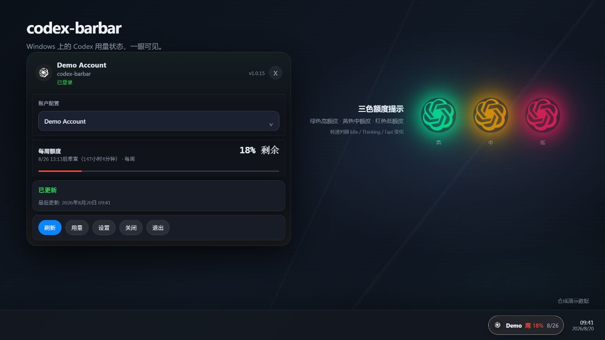
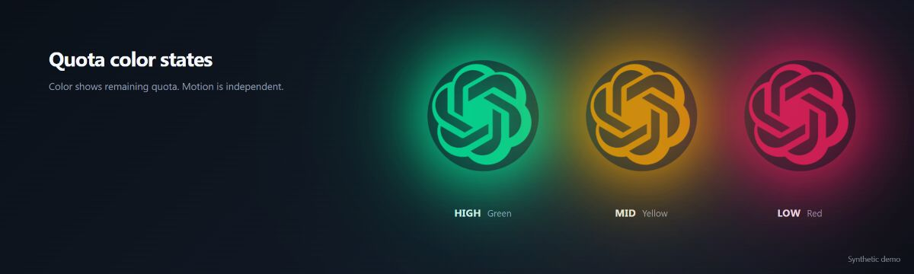
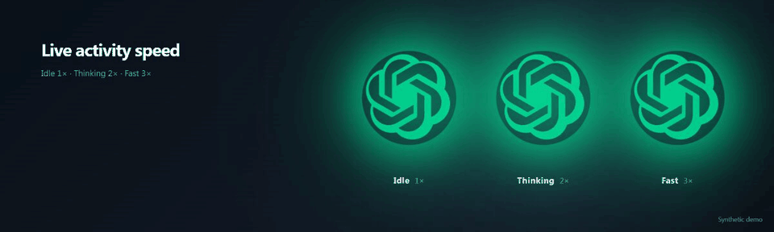
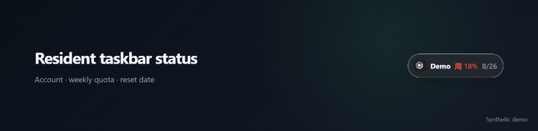

# codex-barbar

> [English](README.md) | **中文**

**一款在 Windows 托盘显示 Codex 用量与额度的应用。**

悬浮球保持和图标一样大，并顺时针旋转。颜色表示剩余额度（绿 / 金 / 红），
转速表示状态：空闲、思考 ×2、Fast ×3。

codex-barbar 是一款 Windows 11 x64 托盘应用，用于随时查看你的
[Codex](https://developers.openai.com/codex/) 用量与额度。它通过官方
Codex App Server 协议读取数据，凭据保存在本地，并在托盘、任务栏和悬浮球中实时展示额度。



_展示图由当前 React/CSS 真实组件渲染；其中的账号名、日期和额度均为合成演示数据。_

## 界面展示

### 三色额度状态



- 绿色：剩余 67–100%
- 黄色：剩余 34–66%
- 红色：剩余 0–33%

### 运行状态动画



颜色与转速相互独立：颜色表示剩余额度；顺时针转速表示运行状态：
**空闲 1×**、**思考 2×**、**Fast 3×**。

### 任务栏常驻状态



## 功能特性

- 托盘面板：显示账号、额度、重置时间和手动刷新
- 任务栏状态条（可选，透明度可调）
- 悬浮球（可选）：绿 / 黄 / 红三档额度颜色
- 顺时针状态动画：空闲 1×、思考 2×、Fast 3×
- 自动刷新额度（默认每 5 分钟）
- 显示真实 OpenAI 账号名（而不是 "current cli"）
- 每周额度与重置倒计时
- 按用户安装，无需管理员权限
- 无遥测；凭据本地保存（DPAPI 保护）

## 快速开始

1. 前往 [Releases](https://github.com/naipi11/codex-barbar/releases/latest) 页面。
2. 下载 `codex-barbar_<version>_x64-setup.exe`（推荐）或 `codex-barbar_<version>_x64-portable.zip`。
3. 运行安装包（按用户安装，无需管理员）或解压后启动便携版。
4. 应用启动后在系统托盘运行，点击托盘图标打开用量面板。
5. 若显示**未登录**，在终端执行 `codex login`，然后在面板点击**刷新**。
6. 打开**设置 → 通用**配置任务栏状态和悬浮球。新安装默认启用**登录时启动**与悬浮球；任务栏状态为可选功能，默认关闭。

## 系统要求

- Windows 11 x64（23H2 或更新版本）
- 已安装并登录的 [Codex](https://developers.openai.com/codex/)（`codex login`）

## 首次使用

数据保存在 `%LOCALAPPDATA%\codex-barbar`。如需彻底清除账号与缓存，关闭应用后删除该目录，
或使用卸载程序的“删除本地账号与缓存”确认提示。

## 设置

- **通用** — 登录时启动、任务栏状态、悬浮球、透明度、刷新间隔、显示模式、主题、语言
- **账户** — 管理已登录的 Codex 账号
- **高级** — Codex 可执行文件路径校验与诊断导出
- **关于** — 版本与更新检查

## 数据与隐私

- 通过官方（实验性）`codex app-server` stdio JSONL 协议读取额度；`experimentalApi` 保持关闭，私有 `/wham/*` 调用已移除。
- 托管账号使用隔离的 `CODEX_HOME`、强制文件凭据存储，并使用 Windows DPAPI（仅当前用户）保护凭据。
- 当前 CLI 账号为只读。codex-barbar 不会代替你登录、登出、切换或删除账号。
- 无遥测。启动时不会检查、下载或应用更新；更新检查由你在界面中手动触发。

## 开发

```text
# Rust 后端 / CLI
cargo test --manifest-path rust/Cargo.toml
cargo clippy --manifest-path rust/Cargo.toml --all-targets -- -D warnings

# Tauri 外壳 crate
cargo test --manifest-path apps/desktop-tauri/src-tauri/Cargo.toml
cargo clippy --manifest-path apps/desktop-tauri/src-tauri/Cargo.toml --all-targets -- -D warnings

# 前端（使用 pnpm）
pnpm --dir apps/desktop-tauri install
pnpm --dir apps/desktop-tauri test
pnpm --dir apps/desktop-tauri run tauri:build
```

详细说明见 [docs/BUILDING.md](docs/BUILDING.md) 与 [docs/ARCHITECTURE.md](docs/ARCHITECTURE.md)。

## 文档

- [PRIVACY.md](PRIVACY.md) — 存储内容、位置与威胁边界
- [TROUBLESHOOTING.md](TROUBLESHOOTING.md) — 错误状态与恢复步骤
- [docs/TESTED_CODEX_VERSIONS.md](docs/TESTED_CODEX_VERSIONS.md) — 已测试的 Codex 版本范围
- [CHANGELOG.md](CHANGELOG.md) — 版本历史

## 上游

codex-barbar 是 [CodexBar](https://github.com/steipete/CodexBar) 的 Windows 移植版。
审计来源记录与冻结基线见 [UPSTREAMS.md](UPSTREAMS.md)。

## 许可证

MIT — 见 [LICENSE](LICENSE)。
