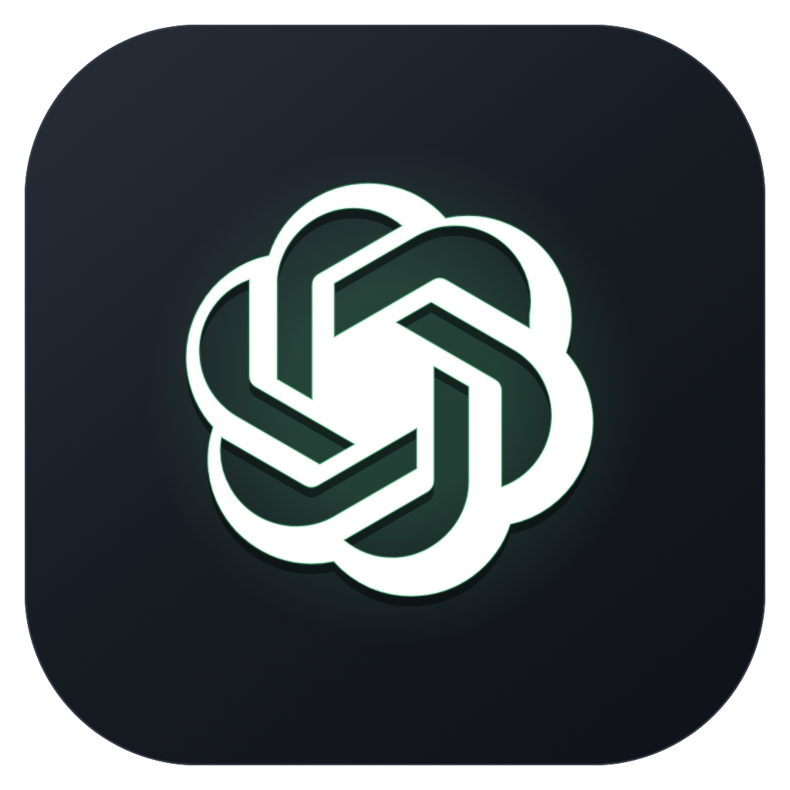
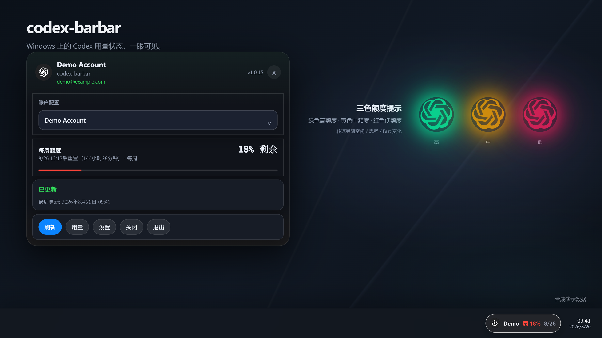
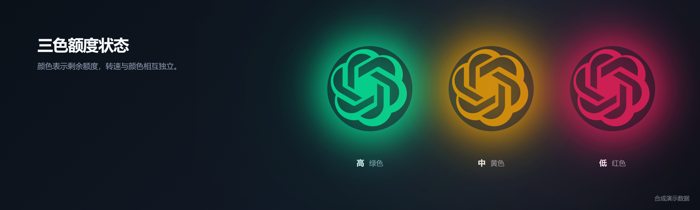
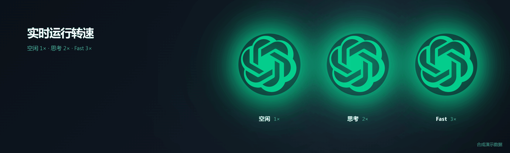

<div align="center">
  
  <h1>codex-barbar</h1>
  <p><strong>一款在 Windows 与 Ubuntu 托盘显示 Codex 用量与额度的应用。</strong></p>
  <p><a href="README.md">English</a> · <strong>中文</strong></p>
</div>

<p align="center">
  <a href="https://github.com/naipi11/codex-barbar/releases/latest"></a>
  <a href="https://github.com/naipi11/codex-barbar/actions/workflows/pr-check.yml"></a>
  <a href="https://github.com/naipi11/codex-barbar/releases"></a>
  <a href="https://github.com/naipi11/codex-barbar/stargazers"></a>
  <a href="LICENSE"></a>
</p>

<p align="center">
  
  
  
  
  
</p>

悬浮球保持和图标一样大，并顺时针旋转。颜色表示剩余额度（绿 / 金 / 红），
转速表示状态：空闲、思考 ×2、Fast ×3。

codex-barbar 是一款 Windows 11 x64 与 Ubuntu 24.04 amd64 托盘应用，用于随时查看你的
[Codex](https://developers.openai.com/codex/) 用量与额度。它通过官方
Codex App Server 协议读取数据，凭据保存在本地，并在托盘和悬浮球中实时展示额度；
任务栏状态仅支持 Windows。Ubuntu 桌面验收尚未完成，Debian 资产发布前请先查看
[Linux 验收说明](docs/LINUX_ACCEPTANCE.md)。



_展示图由当前 React/CSS 真实组件渲染；其中的账号名、日期和额度均为合成演示数据。_

## 界面展示

### 三色额度状态



- 绿色：剩余 67–100%
- 黄色：剩余 34–66%
- 红色：剩余 0–33%

### 运行状态动画



颜色与转速相互独立：颜色表示剩余额度；顺时针转速表示运行状态：
**空闲 1×**、**思考 2×**、**Fast 3×**。

### 任务栏常驻状态


## Star History

[](https://star-history.com/#naipi11/codex-barbar&Date)

## 功能特性

- 托盘面板：显示账号、额度、重置时间和手动刷新
- 任务栏状态条（仅 Windows；可选，透明度可调）
- 悬浮球（可选）：绿 / 黄 / 红三档额度颜色
- 顺时针状态动画：空闲 1×、思考 2×、Fast 3×
- 自动刷新额度（默认每 5 分钟）
- 显示真实 OpenAI 账号名（而不是 "current cli"）
- 每周额度与重置倒计时
- Windows 按用户安装，无需管理员权限
- 无遥测；凭据本地保存（Windows 使用 DPAPI；Linux 发布验收要求使用 Secret Service，禁止明文回退）

## 快速开始

### Windows 11 x64

1. 前往 [Releases](https://github.com/naipi11/codex-barbar/releases/latest) 页面。
2. 下载 `codex-barbar_<version>_x64-setup.exe`（推荐）或 `codex-barbar_<version>_x64-portable.zip`。
3. 运行安装包（按用户安装，无需管理员）或解压后启动便携版。
4. 应用启动后在系统托盘运行，点击托盘图标打开用量面板。
5. 若显示**未登录**，在终端执行 `codex login`，然后在面板点击**刷新**。
6. 打开**设置 → 通用**配置任务栏状态和悬浮球。新安装默认启用**登录时启动**与悬浮球；任务栏状态为可选功能，默认关闭。

### Ubuntu 24.04 amd64（桌面验收待完成）

当前计划的 Debian 资产名为 `codex-barbar_1.1.0_amd64.deb`。该文件名并不表示
已经发布或验收：发布前必须完成
[docs/verification/linux/ubuntu-24.04-acceptance.md](docs/verification/linux/ubuntu-24.04-acceptance.md)
记录，且 Windows 与 Ubuntu CI 均为绿色。

1. 下载与你已核实的版本对应的 `codex-barbar_<version>_amd64.deb`。
2. 使用 APT 安装，使 WebKitGTK、GTK、AppIndicator 与 Secret Service 依赖自动解析：

   ```bash
   sudo apt install ./codex-barbar_1.1.0_amd64.deb
   ```

3. 执行 `codex-barbar` 启动应用，点击托盘图标打开面板。若显示**未登录**，执行
   `codex login` 后刷新。
4. GNOME 是主要目标桌面；KDE 为尽力支持，面板和 AppIndicator 集成可能不同。
   可用时要分别在 Wayland 与 X11 下验证；Wayland 中悬浮球是普通可拖动窗口，位置和置顶
   效果可能受合成器策略限制。

## 系统要求

- Windows 11 x64（23H2 或更新版本）
- 已安装并登录的 [Codex](https://developers.openai.com/codex/)（`codex login`）
- Debian 目标为 Ubuntu 24.04 amd64，且桌面需要可用的 GNOME/KDE 托盘或
  AppIndicator 实现。包声明 `libwebkit2gtk-4.1-0`、`libgtk-3-0`、
  `libayatana-appindicator3-1` 与 `libsecret-1-0`。

## 首次使用

数据保存在 `%LOCALAPPDATA%\codex-barbar`。如需彻底清除账号与缓存，关闭应用后删除该目录，
或使用卸载程序的“删除本地账号与缓存”确认提示。

## 设置

- **通用** — 登录时启动、任务栏状态、悬浮球、透明度、刷新间隔、显示模式、主题、语言
- **账户** — 管理已登录的 Codex 账号
- **高级** — Codex 可执行文件路径校验与诊断导出
- **关于** — 版本与更新检查

## 数据与隐私

- 通过官方（实验性）`codex app-server` stdio JSONL 协议读取额度；`experimentalApi` 保持关闭，私有 `/wham/*` 调用已移除。
- 托管账号使用隔离的 `CODEX_HOME`、强制文件凭据存储，并使用 Windows DPAPI（仅当前用户）保护凭据。
- Linux 托管凭据必须存入桌面的 Secret Service；磁盘 vault 仅能保存
  `codex-barbar-secret-service:v1:<profile-uuid>` 标记。Secret Service 锁定或不可用时
  必须报错，绝不回退到明文凭据；在真实 Ubuntu 桌面完成记录前，此项仍是发布验收要求。
- 当前 CLI 账号为只读。codex-barbar 不会代替你登录、登出、切换或删除账号。
- 无遥测。启动时不会检查、下载或应用更新；更新检查由你在界面中手动触发。

## 开发

```text
# Rust 后端 / CLI
cargo test --manifest-path rust/Cargo.toml
cargo clippy --manifest-path rust/Cargo.toml --all-targets -- -D warnings

# Tauri 外壳 crate
cargo test --manifest-path apps/desktop-tauri/src-tauri/Cargo.toml
cargo clippy --manifest-path apps/desktop-tauri/src-tauri/Cargo.toml --all-targets -- -D warnings

# 前端（使用 pnpm）
pnpm --dir apps/desktop-tauri install
pnpm --dir apps/desktop-tauri test
pnpm --dir apps/desktop-tauri run tauri:build
```

详细说明见 [docs/BUILDING.md](docs/BUILDING.md) 与 [docs/ARCHITECTURE.md](docs/ARCHITECTURE.md)。

## 文档

- [PRIVACY.md](PRIVACY.md) — 存储内容、位置与威胁边界
- [TROUBLESHOOTING.md](TROUBLESHOOTING.md) — 错误状态与恢复步骤
- [docs/TESTED_CODEX_VERSIONS.md](docs/TESTED_CODEX_VERSIONS.md) — 已测试的 Codex 版本范围
- [docs/LINUX_ACCEPTANCE.md](docs/LINUX_ACCEPTANCE.md) — Ubuntu 桌面与包验收门槛
- [CHANGELOG.md](CHANGELOG.md) — 版本历史

## 上游

codex-barbar 是 [CodexBar](https://github.com/steipete/CodexBar) 的 Windows 移植版。
审计来源记录与冻结基线见 [UPSTREAMS.md](UPSTREAMS.md)。

## 许可证

MIT — 见 [LICENSE](LICENSE)。
