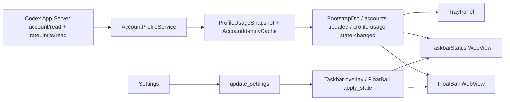

# codex-barbar 任务栏状态、动画悬浮球与 OpenAI 账号身份设计

**状态：** 已获用户确认并完成 spec 自检，进入实现计划  
**基线：** `v1.0.0` / 提交 `2d444c5767624e1cdb3eb0e3697aff7ccaae85e0`  
**目标分支：** `codex/taskbar-floatball-identity`

## 1. 目标

在现有 Windows 11 Tauri 2 桌面壳层上增加三个紧密相关的能力：

1. 任务栏槽位状态显示：把一个紧凑状态组件视觉上放进用户截图中红框所示的 Windows 任务栏空白区，并提供独立开关。
2. 动画悬浮球：创建一个独立的、可拖动的圆形用量状态球，显示当前账号和主要额度，带轻量环形进度与呼吸动画，并提供独立开关。
3. OpenAI 账号身份：从 Codex App Server `account/read` 读取实际的账号显示名；若协议版本不返回显示名，则使用真实邮箱；任何界面都不再把 `Current CLI` 当作用户可见账号名。

任务栏状态和悬浮球共享同一份 profile-scoped 用量缓存、刷新节奏和账号身份数据。设置变更应在运行中的窗口中即时生效，不需要重启应用。

## 2. 明确的技术边界

### 2.1 “嵌入任务栏”的实现定义

Windows 公开 API 可以为应用自己的任务栏按钮设置进度或覆盖图标，但没有稳定、受支持的 API 把任意 HTML/WebView 子界面插入 Windows 11 任务栏中间空白区。旧 DeskBand/Explorer 注入路径不属于本产品的稳定发布边界。

因此本 spec 采用“视觉嵌入覆盖层”：

- 创建一个透明、无边框、无激活、`skipTaskbar=true` 的小型 Tauri WebView 窗口。
- 通过 Win32 读取 Explorer 任务栏和通知区域的矩形，把窗口定位到红框对应的槽位。
- 不修改 Explorer，不把窗口作为 Explorer 子窗口，不安装 Shell 扩展，不占用桌面工作区。
- 任务栏移动、DPI、自动隐藏、Explorer 重启或显示器变化时自动重新定位。

用户视觉上看到的是任务栏中的原生样式状态组件；实现上是一个受控覆盖层。若 Windows 未来改变 Explorer 内部窗口层级，覆盖层会回退到任务栏主矩形中的安全位置，而不是注入 Explorer。

### 2.2 账号身份的隐私边界

- 账号身份只用于本机 UI 和本机状态窗口。
- 账号邮箱/显示名不得写入日志、诊断导出、错误消息、窗口标题或遥测数据。
- 身份缓存使用现有 `secure_file` Windows DPAPI 当前用户保护；SQLite 继续保存不可逆的 `email_fingerprint`，不新增明文邮箱列。
- 如果身份读取失败或缓存不可解密，界面显示“未登录”或“账号信息不可用”，保留上一份成功的用量数据。
- 现有 `hide_personal_info` 语义在后续扩展中可用于遮蔽身份；本次 V1.1 功能默认按用户要求显示本机账号名/邮箱，但不改变诊断脱敏规则。

## 3. 用户体验

### 3.1 任务栏状态组件

默认关闭，开启后：

- 组件位于当前 Windows 任务栏主轴上、通知区域左侧的槽位。
- 水平任务栏显示：`[Codex 图标] 账号名  72%`。
- 状态颜色：
  - 绿色：`usedPercent < 75`；
  - 琥珀色：`75 <= usedPercent < 90`；
  - 红色：`usedPercent >= 90`、额度耗尽或当前刷新出错；
  - 灰色：没有成功缓存或未登录。
- 账号名使用解析后的 `accountDisplayName`；过长文本使用中间省略，完整值放在 tooltip。
- 单击组件打开现有托盘面板；组件本身不抢占前台应用焦点。
- 右键不实现自定义菜单，保留任务栏/系统菜单的正常行为；设置和退出仍通过托盘菜单提供。
- 任务栏自动隐藏时，组件随任务栏隐藏；任务栏重新显示后在同一槽位恢复。

组件不显示完整配额卡片、不显示成本、不显示多个 profile 列表；它是一个单行状态入口。

### 3.2 动画悬浮球

默认关闭，开启后：

- 以独立窗口显示在上一次保存的位置；首次显示默认落在主显示器右下角、避开任务栏和屏幕边缘。
- 圆形主体显示主要窗口的剩余百分比；环形进度颜色与任务栏状态颜色一致。
- 主要窗口取 `primary`，缺少 `primary` 时取 `secondary`；两者都缺少时显示灰色空环和“未登录”或“账号信息不可用”。
- 账号名显示在球内的短标签或 tooltip 中；完整账号名通过悬停 tooltip 提供。
- 轻量动画：
  - 正常状态：缓慢呼吸；
  - 琥珀/红色状态：环形进度有更明显但低频的脉动；
  - 刷新中：环形边缘显示短暂旋转；
  - `prefers-reduced-motion: reduce` 时禁用位移和脉动，只保留静态颜色。
- 左键打开托盘面板；拖动球体移动位置；位置按逻辑坐标持久化。
- 窗口使用 `WS_EX_NOACTIVATE`，打开/点击不会夺走当前应用焦点。
- 不默认启用点击穿透；后续可在高级设置扩展为独立的“点击穿透”选项。

悬浮球与任务栏组件可同时开启，互不覆盖；两者都只显示当前选中 profile。

### 3.3 账号显示规则

服务端解析并规范化以下字段（大小写和 snake/camel 形式均兼容）：

1. `displayName`
2. `display_name`
3. `name`
4. `fullName`
5. `email` / `emailAddress`

规范化后的展示优先级：

```text
displayName/name/fullName
    -> email
    -> 未登录
```

Profile 的用户自定义标签仍保留：

- `CurrentCli` profile：UI 主标题使用实际账号名/邮箱；不再显示 `Current CLI`。
- `Managed` profile：列表主标题继续使用用户自定义标签；同时显示实际账号名/邮箱作为副标题或 tooltip。

账号信息读取成功后，更新身份缓存并发布 `accounts-updated`；读取失败不清空最后一份成功身份。

## 4. 架构与数据流



### 4.1 Rust 领域模型

新增 `AccountIdentityRecord`（位置固定为 `rust/src/accounts/identity.rs`，由
`rust/src/accounts/mod.rs` 导出）：

```rust
pub struct AccountIdentityRecord {
    pub display_name: Option<String>,
    pub email: Option<String>,
    pub plan_type: Option<String>,
    pub updated_at: DateTime<Utc>,
}
```

新增 `AccountIdentityCache`：

- 文件：`AppPaths::discover()?.root.join("identity").join("profiles.json")`
  （Windows 默认解析为 `%LOCALAPPDATA%\codex-barbar\identity\profiles.json`；测试
  通过注入 `AppPaths::from_local_app_data` 使用临时目录）
- 编码：JSON 内容通过 `secure_file::write_string/read_string` 保护；Windows 使用 DPAPI 当前用户。
- 键：`ProfileId` 字符串。
- 写入：当前 CLI 或 managed profile 的 `account/read` 成功后原子替换临时文件。
- 删除：managed profile 删除时同步删除对应记录。
- 故障策略：读失败只记录非敏感诊断码，返回空身份，不阻塞应用启动。

`AccountIdentity` wire model 扩展为解析可选名称字段；`parse_profile_usage` 将身份写入内存中的 profile usage 快照，供本次刷新事件使用。

`AccountProfilesSnapshot` 增加一个只在内存/桥接阶段使用的身份映射，或由 `AccountProfileService` 提供等价的 `identity_for(profile_id)` 查询；不把明文身份写入 `account_profiles` 表。

### 4.2 Bridge DTO

`ProfileSummaryDto` 增加：

```ts
accountDisplayName: string | null;
accountEmail: string | null;
```

约束：

- 两者只能来自选中 Codex profile 的 App Server 身份；
- 不跨 provider 复用；
- `accountEmail` 为 `null` 时不生成占位邮箱；
- `label` 对 Current CLI 使用 `accountDisplayName ?? "未登录"`，不再返回 `"Current CLI"`；
- 序列化测试必须确认 token、cookie、路径、vault 字段不会进入 DTO。

`BootstrapDto` 仍保持原有顶层字段，不新增第二套状态源。任务栏/悬浮球通过 `get_bootstrap_state` 获取初始值，并订阅现有账号、用量、刷新、设置事件。

### 4.3 设置模型

在活动 V1 `rust/src/storage::AppSettings` 中新增字段：

```rust
pub taskbar_status_enabled: bool,
pub float_ball_enabled: bool,
```

默认值均为 `false`，保证升级后不突然覆盖用户任务栏。

桥接字段：

```ts
taskbarStatusEnabled: boolean;
floatBallEnabled: boolean;
```

`SettingsPatchDto` 支持部分更新；未知字段和错误类型继续拒绝。更新成功后：

1. 持久化 SQLite `app_settings`；
2. 发出 `settings-changed`；
3. 由壳层调用 `taskbar_overlay::apply_state` 和 `float_ball::apply_state`；
4. 由两个 WebView 重新读取 `get_bootstrap_state` 或配置事件。

### 4.4 任务栏槽位覆盖层

建议新增模块：

```text
apps/desktop-tauri/src-tauri/src/taskbar_overlay/
  mod.rs
  window.rs
  positioning.rs
```

职责：

- `window.rs`：创建/显示/隐藏/销毁 `taskbar-status` WebView，应用透明、无激活、置顶和尺寸。
- `positioning.rs`：纯函数计算任务栏槽位；Windows 适配层读取真实矩形。
- `mod.rs`：安装、设置变更、Explorer 重启恢复、窗口事件转发。

定位算法：

1. 查找当前显示器的 `Shell_TrayWnd`，读取任务栏边缘和矩形。
2. 递归查找 `TrayNotifyWnd`/系统通知区矩形，取其主轴起点作为槽位右/下边界；
   槽位另一端取任务栏应用区的安全边界，找不到时使用任务栏主矩形起点。
3. 以固定逻辑宽度 260、主轴边距 8、交叉轴居中计算窗口位置；若可用槽位不足
   260 逻辑像素，则将宽度缩小到至少 160 逻辑像素并对文本启用省略。
4. 找不到通知区时，使用任务栏矩形的安全回退位置，并继续后台重试。
5. 使用当前 monitor 的 DPI 将逻辑尺寸转换为物理尺寸。
6. 对上/下/左/右任务栏分别计算；不依赖单一的底部任务栏假设。

窗口样式：

- Tauri：透明、无装饰、不可调整、`skipTaskbar=true`、`alwaysOnTop=true`、隐藏启动。
- Win32：`WS_EX_TOOLWINDOW | WS_EX_NOACTIVATE | WS_EX_LAYERED`；不创建任务栏按钮。
- `SetWindowPos(HWND_TOPMOST, ..., SWP_NOACTIVATE)`；不调用激活 API。
- 监听/轮询任务栏窗口销毁、显示器变化、DPI 变化、`WM_SETTINGCHANGE`、自动隐藏状态；Explorer 重启后自动重建。

### 4.5 悬浮球窗口

建议新增模块：

```text
apps/desktop-tauri/src-tauri/src/float_ball/
  mod.rs
  window.rs
  geometry.rs
```

职责与任务栏模块相同，但位置由用户拖动并通过现有 `geometry_store` 保存。

窗口标签固定为 `float-ball`，前端路由固定为 `FloatBall`。窗口事件只处理移动、关闭和显示器断开恢复；关闭按钮不永久关闭功能，真正的开关由设置控制。

### 4.6 React 表面

新增：

```text
apps/desktop-tauri/src/surfaces/TaskbarStatus.tsx
apps/desktop-tauri/src/surfaces/TaskbarStatus.css
apps/desktop-tauri/src/surfaces/FloatBall.tsx
apps/desktop-tauri/src/surfaces/FloatBall.css
apps/desktop-tauri/src/hooks/useStatusSurface.ts
```

`useStatusSurface` 只负责：

- bootstrap 初始读取；
- 订阅 `accounts-updated`、`profile-usage-state-changed`、`refresh-state-changed`、`settings-changed`；
- 选中 profile 和主要 quota 的派生；
- 处理无账号、未登录、过期缓存、刷新中的状态。

TaskbarStatus 和 FloatBall 只负责展示和用户交互，不能直接读取 SQLite、环境变量或 Codex 文件。

## 5. 错误与降级

| 情况 | 任务栏状态 | 悬浮球 | 账号名称 |
|---|---|---|---|
| 正常缓存 | 显示百分比和颜色 | 显示环形百分比 | 名称或邮箱 |
| 刷新中 | 保留旧值并显示短暂刷新指示 | 环形边缘旋转 | 保留旧值 |
| 离线/超时 | 保留旧值，状态变灰或带 stale 标志 | 保留旧值，降低透明度 | 保留旧值 |
| 未登录 | 显示“未登录” | 显示灰色空环 | “未登录” |
| 身份缓存损坏 | 用量仍可显示 | 用量仍可显示 | “账号信息不可用” |
| Explorer 重启 | 覆盖层隐藏并重定位 | 不受影响 | 不受影响 |
| 任务栏无法定位 | 使用安全回退位置；不阻塞主应用 | 不受影响 | 不受影响 |

任何窗口创建/定位失败都只能记录非敏感诊断码，不得让主托盘或设置窗口启动失败。

## 6. 测试与验收

### 6.1 Rust 单元测试

- `AccountIdentity::from_value`：
  - `displayName` 优先；
  - `name`/`fullName` 兼容；
  - 无名称时使用 email；
  - 缺少身份字段时返回空身份；
  - 原始 JSON 中的 token 不进入身份记录。
- `AccountIdentityCache`：
  - 写入/读取 round-trip；
  - 原子写入失败不损坏旧缓存；
  - 删除 profile 后没有悬挂身份；
  - Windows secure-file 输出不包含明文邮箱。
- `ProfileSummaryDto`：
  - Current CLI 不出现字符串 `Current CLI`；
  - display name/email fallback 顺序正确；
  - DTO 不泄漏凭据、路径和诊断字段。
- 任务栏定位纯函数：
  - 上/下/左/右任务栏；
  - 100/125/150/200% DPI；
  - 通知区存在/缺失；
  - 小屏幕回退和边界夹紧；
  - 自动隐藏矩形。
- 悬浮球几何：
  - 首次位置避开任务栏；
  - 负坐标多显示器；
  - 断开显示器后回退主屏；
  - 保存位置使用逻辑坐标。

### 6.2 前端测试

- `TaskbarStatus.test.tsx`：
  - 正常/警告/临界/未登录状态；
  - 账号名优先于邮箱；
  - 长账号名中间省略且 tooltip 保留完整值；
  - 单击调用打开面板。
- `FloatBall.test.tsx`：
  - 环形进度百分比；
  - 状态颜色；
  - `prefers-reduced-motion` 下没有动画 class；
  - 单击打开面板，拖动不会触发打开。
- `GeneralTab.test.tsx`：
  - 两个开关初始值；
  - 部分更新只提交对应字段。
- `App.test.tsx`：
  - `taskbar-status` 和 `float-ball` 标签路由正确；
  - 未知窗口标签仍不渲染业务 UI。

### 6.3 Windows 验收

必须使用新构建的 debug binary，关闭旧的 codex-barbar 进程后验证：

1. 红框位置：组件位于任务栏应用区域与通知区之间，不遮挡系统图标。
2. 四种任务栏边缘：下、上、左、右。
3. DPI：100%、125%、150%、200%。
4. 双显示器：主屏和副屏切换后重定位。
5. 任务栏自动隐藏：隐藏/显示时状态层同步。
6. Explorer 重启：`explorer.exe` 重启后 5 秒内恢复。
7. 焦点：点击/刷新不把焦点从前台应用抢走。
8. 悬浮球拖动、重启后位置恢复、动画和 reduced-motion。
9. 关闭两个开关后对应窗口消失，托盘面板仍可用。
10. 真实 Codex 登录：显示具体 OpenAI 账号名或邮箱，不显示 `Current CLI`。

CUA 驱动不可用时，使用 Win32 窗口枚举、矩形采集和 `PrintWindow` 截图，并在验收记录中注明替代证据。

## 7. 兼容、迁移与发布

- `AppSettings` JSON/SQLite 缺少新字段时按 `false` 读取；现有用户升级后不会自动显示新窗口。
- 新窗口标签、事件名和命令名固定，不复用旧版被删除的 FloatBar surface，避免与历史代码产生隐式耦合。
- 版本号在功能验证完成后提升为 `1.1.0-rc.1`；本 spec 不包含发布、GitHub Release 或 Winget 操作。
- 失败回退只需把两个设置字段置为 `false`；主托盘和账号刷新链路不依赖覆盖层。

## 8. 不在本次范围内

- Explorer DLL 注入、DeskBand 注册、修改系统任务栏布局。
- 任务栏槽位中的多账号切换器、成本明细、图表或交互菜单。
- 云端账号管理、跨设备同步、遥测。
- 自动更新、安装器品牌改造、Winget 提交。
- 除 Codex/OpenAI 之外的新 provider。
