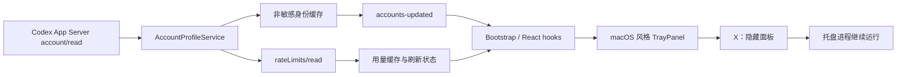

# codex-barbar macOS 风格面板与 OpenAI 账号身份修复设计

**状态：** 待用户审阅  
**基线：** `codex/taskbar-floatball-identity` / `0a4da91c`  
**目标：** 修复面板显示“未登录”、补充可用的关闭按钮，并将主面板重做为 macOS 菜单栏小卡片风格。

## 1. 背景与问题证据

当前主面板是 Tauri 配置中的 `main` WebView，使用无边框窗口：

- `decorations: false`
- `visible: false`
- `skipTaskbar: true`
- 失去焦点时由 `flyout_window` 自动隐藏

因此没有 Windows 原生标题栏，也不会出现系统 X。现有 `dismissTrayPanel` 只隐藏窗口，继续保留托盘进程。

当前机器上的 Codex CLI 为 `0.146.0`。对真实 App Server 做脱敏只读探针后，`account/read` 返回了账号对象、认证类型、邮箱和方案字段，但没有显示名字段；随后 `account/rateLimits/read` 因网络端点返回 `403 Forbidden`。这说明身份读取和额度读取是两个独立结果，不能用额度接口是否成功来推断是否登录。

现有代码已经能够解析邮箱字段并写入身份缓存，但存在两个可见问题：

1. 面板启动时只读取 bootstrap 中的身份缓存，当前安装目录没有身份缓存文件时直接回退到“未登录”。
2. `refresh_current_cli` 在身份缓存写入后，如果额度接口失败会提前返回，未向前端发布账号更新事件；本次刷新产生的身份不会立即显示。

本设计不读取、显示或记录 token、cookie、auth.json 原文或其他凭据。

## 2. 用户确认的范围

### 2.1 关闭行为

右上角 X 的语义为“隐藏面板”：

- 调用现有 `dismissTrayPanel`。
- 不退出 codex-barbar 后台进程。
- 托盘图标、任务栏状态组件和悬浮球仍可重新打开面板。
- 保留 Esc 和失焦自动隐藏。
- “退出应用”仍是单独的明确操作。

### 2.2 视觉方向

采用“macOS 菜单栏小卡片”方案：

- 深色半透明背景、16–20px 圆角、柔和阴影。
- 紧凑顶部工具栏和圆形 X。
- 账户信息使用头像、主文本和次级状态文本。
- 用量以主视觉卡片呈现，减少粗边框和信息噪声。
- 操作使用胶囊按钮或图标按钮。
- 保留键盘导航、ARIA 和 reduced-motion 支持。

不改变任务栏状态 overlay、动画悬浮球、Codex provider 选择或现有设置开关的产品语义。

## 3. 目标与非目标

### 3.1 目标

- 面板显示真实 OpenAI 账号显示名；若协议不提供显示名，显示真实邮箱。
- 账号身份与额度刷新状态分离。
- 额度接口失败时保留旧额度并明确提示“额度暂不可刷新”。
- 主面板有可见、可键盘操作的关闭按钮。
- 面板视觉统一为 macOS 风格，同时不破坏现有功能和窗口路由。
- 在真实 Windows fresh build 上验证关闭、重新打开、身份展示和视觉状态。

### 3.2 非目标

- 不实现 Explorer DLL 注入或真正把 WebView 子控件嵌入任务栏。
- 不从本地 auth 文件读取明文凭据作为身份来源。
- 不改造 Codex App Server 的远程认证、网络代理或 403 处理策略。
- 不引入新的 UI 框架、图标包或运行时依赖。
- 不改变退出应用的语义。

## 4. 设计概览



核心原则是“身份成功即可展示，额度成功与否另行展示”。

## 5. 后端与桥接设计

### 5.1 身份读取和缓存

继续使用 `rust/src/providers/codex/app_server/model.rs` 的 `AccountIdentity`，支持以下大小写和命名形式：

```text
displayName / display_name
name
fullName / full_name
email / emailAddress
planType / plan_type / plan
```

规范化和安全规则：

- 空字符串和全空白字段视为缺失。
- `Current CLI`、`current_cli` 等内部标签不能作为用户身份。
- 不把 token、cookie、authorization、auth 文件路径或完整 RPC 响应写入日志。
- `AccountIdentityCache` 继续使用现有 `secure_file` 和原子替换策略。

身份缓存记录保持 profile-scoped：

```rust
pub struct AccountIdentityRecord {
    pub display_name: Option<String>,
    pub email: Option<String>,
    pub plan_type: Option<String>,
    pub updated_at: DateTime<Utc>,
}
```

### 5.2 刷新事件顺序

`AccountProfileService::refresh_current_cli` 和 managed profile 刷新都采用以下顺序：

1. 建立 App Server 会话。
2. 调用 `account/read`。
3. 身份解析成功后立即写入身份缓存。
4. 立即发布一次 `ProfilesChanged`/`accounts-updated`，使前端无需等待额度接口。
5. 调用 `account/rateLimits/read`。
6. 额度成功时保存用量并发布 `UsageStateChanged`。
7. 额度失败时保存可恢复的刷新错误、保留上次用量，并发布包含旧快照和错误状态的 `UsageStateChanged`。
8. 关闭会话。

身份缓存写入失败时不阻塞额度读取；前端显示“账号信息不可用”，但仍可显示额度。

### 5.3 DTO 增强

`ProfileSummaryDto` 保留现有字段并新增明确的身份状态：

```ts
type AccountStatus = "signedIn" | "signedOut" | "unavailable";

interface ProfileSummaryDto {
  // existing fields
  accountDisplayName: string | null;
  accountEmail: string | null;
  accountStatus: AccountStatus;
  accountUpdatedAt: string | null;
}
```

定义：

- `signedIn`：最近一次 `account/read` 成功，至少有可用的认证身份结果；名称和邮箱都可能为空。
- `signedOut`：App Server 明确返回未登录。
- `unavailable`：身份缓存损坏、读取失败或当前尚未完成身份探测。

Current CLI 的 `label` 生成规则：

```text
displayName -> email -> 已登录（名称不可用） -> 未登录
```

`Current CLI` 只允许作为内部 profile label 存在，不得进入用户可见 DTO 文本。

### 5.4 账号更新事件

复用现有 `accounts-updated` 事件，避免新增第二套账号状态源。身份缓存写入成功后发布当前 profile snapshot；前端收到事件后替换对应 profile，不重置当前选中的用量缓存。

如果事件发布失败，只记录非敏感诊断码；bootstrap 下次读取仍可获得缓存身份。

## 6. TrayPanel 视觉和交互设计

### 6.1 结构

React surface 保持 `TrayPanel` 路由不变，内部拆为以下可测试区域：

```text
TrayPanel
├─ TrayHeader
│  ├─ product mark + product name
│  ├─ account identity summary
│  ├─ version
│  └─ close button
├─ AccountCard / ProfileSelector
├─ QuotaCard (primary)
├─ QuotaCard (secondary)
├─ UsageStatus
└─ TrayActions
```

顶部工具栏固定可见，内容区独立滚动。

### 6.2 顶部工具栏

- `header` 使用 44–52px 高度、左右 12–16px 内边距。
- 关闭按钮为 28–32px 圆形 icon button，`aria-label="隐藏面板"`。
- 关闭按钮 hover、focus-visible 和 pressed 状态有轻微背景变化。
- 关闭按钮不能调用 `quitApp`。
- 账号主文本优先显示 `accountDisplayName`，次文本显示 `accountEmail` 或状态文案。
- 不把邮箱写入窗口标题。

### 6.3 账户卡片

- 使用头像圆形容器，账号名首字母作为稳定 fallback。
- 当前 profile 使用自定义 listbox/popover，而不是未样式化原生 select。
- listbox 必须支持键盘上下移动、Enter 选择、Escape 关闭和焦点回收。
- managed profile 保留用户自定义标签，同时显示实际身份作为次级文本。
- 无 profile 时显示登录引导状态，不显示空白下拉框。

### 6.4 用量卡片

- 每张卡片使用低对比度背景和 1px 边框，不使用大面积高亮。
- 标题显示窗口名称，主数值显示剩余百分比。
- 进度条采用单一渐变填充，颜色由 `ready/warning/critical/missing` 状态决定。
- 重置时间和窗口时长使用次级文本。
- 刷新中保留数值并显示小型旋转/脉动标记；reduced-motion 时改为静态点。

### 6.5 数据状态和操作

- `UsageStatus` 作为轻量状态行或提示卡，不再使用粗边框大块区域。
- 403、超时、协议错误统一显示友好文案和恢复动作。
- 刷新、用量详情、设置使用胶囊按钮；退出使用低强调文本按钮。
- 所有按钮保留现有 bridge command，不在前端直接访问文件或环境变量。

### 6.6 CSS 令牌

在 `TrayPanel.css` 中集中定义 surface tokens：

```css
--tray-bg
--tray-surface
--tray-surface-muted
--tray-border
--tray-fg
--tray-fg-muted
--tray-accent
--tray-warning
--tray-critical
--tray-radius
--tray-shadow
```

主题模式仍由 `useTheme` 控制；Windows dark WebView2 主题固定行为不改变。CSS 不新增外部字体或图标依赖。

## 7. 错误与降级矩阵

| 情况 | 账号区域 | 额度区域 | 操作 |
|---|---|---|---|
| `account/read` 成功，额度成功 | 显示名称或邮箱 | 显示最新额度 | 正常刷新 |
| `account/read` 成功，额度 403/超时 | 保留名称或邮箱 | 保留旧额度并标记“暂不可刷新” | 重试、打开设置 |
| 明确未登录 | 显示“未登录” | 灰色空状态或旧缓存 | 打开设置登录 |
| 身份缓存损坏 | 显示“账号信息不可用” | 仍显示可用额度 | 重试 |
| 刷新中 | 保留身份 | 保留数值并显示刷新指示 | 禁止重复刷新或进入冷却 |
| bootstrap 失败 | 显示加载/错误状态 | 不伪造额度 | 重试或退出 |

任何额度错误都不得把一个已经确认的身份改写成“未登录”。

## 8. 测试与验收

### 8.1 Rust

新增或扩展测试：

- `AccountIdentity::from_value` 能从真实形状中解析 email/planType。
- 名称字段优先级和空字符串规范化。
- token、cookie、authorization 不进入身份记录。
- 身份缓存 round-trip、原子写入失败、profile 删除。
- `refresh_current_cli` 在额度失败后仍发布账号更新事件。
- 额度失败后旧快照保留，状态包含可恢复错误。
- DTO 不序列化凭据、路径或原始 RPC 数据。

### 8.2 前端

新增或扩展测试：

- `profileDisplayName` 的名称、邮箱、已登录但无名称、未登录回退。
- `TrayPanel` 显示账号主文本和邮箱次文本。
- 403/暂不可刷新与账号状态分离。
- 关闭按钮存在、ARIA 正确、调用 `dismissTrayPanel` 而非 `quitApp`。
- X、Esc 和底部退出按钮的行为互不混淆。
- listbox 键盘导航、焦点回收和 profile 切换。
- reduced-motion 下不渲染强制动画状态。

### 8.3 Windows fresh-build proof

在关闭旧实例后使用新构建验证：

1. 打开面板可见右上角 X。
2. 点击 X 后窗口隐藏，托盘进程仍存在。
3. 再从托盘、任务栏状态或悬浮球打开面板。
4. 面板显示真实账号名或邮箱，不显示 `Current CLI`。
5. 模拟/复现额度 403 时，账号仍显示，额度卡片显示暂不可刷新。
6. 视觉检查圆角、阴影、间距、内部滚动和暗色主题。
7. 验证 Esc、失焦、reduced-motion 和退出应用。

仓库规定的 CUA driver 若不可用，则使用 fresh debug binary、Win32 窗口枚举、窗口矩形和截图作为替代证据，并在验证记录中明确说明。

## 9. 迁移与兼容

- 缺少 `accountStatus`、`accountUpdatedAt` 的旧 bootstrap fixture 按 `unavailable` 兼容。
- 旧身份缓存记录可继续读取，新字段使用默认值。
- 新增 CSS 不改变任务栏 overlay、悬浮球和设置开关的配置键。
- 不新增 npm、Rust 或图标依赖。
- 不删除现有 `dismissTrayPanel`、`quitApp` 或事件名称。

## 10. 实施顺序

实现阶段按 TDD 分成四个小循环：

1. 先写身份状态 DTO、事件和刷新失败行为的失败测试，再修改 Rust。
2. 写关闭按钮与面板状态行为的失败测试，再修改 React/bridge。
3. 写视觉组件和样式断言，再重构 TrayPanel CSS/markup。
4. 完成全量门禁、fresh Windows 构建、安装和 UI proof。

每个循环都要求先观察测试失败，再实现最小改动并重新验证。

