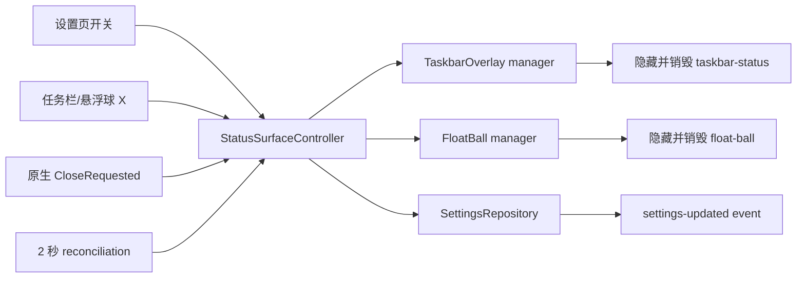

# codex-barbar 任务栏与悬浮球「玻璃轨道」设计

**状态：** 已获用户逐段批准，并于 2026-08-10 通过书面 Spec 复核
**基线：** `codex/taskbar-floatball-identity` / `15a99682`  
**目标：** 重做任务栏状态组件与悬浮球的视觉、信息层级和交互，并彻底修复设置已关闭但辅助窗口仍然可见的问题。

## 1. 背景与问题证据

当前版本有两个辅助 WebView：

- `taskbar-status`：位于 Windows 任务栏通知区域左侧的无边框 overlay。
- `float-ball`：可拖动、始终置顶的圆形悬浮窗口。

现有界面均以单个 `<button>` 呈现：任务栏只显示账号和一个百分比，悬浮球只显示圆环、整数和被截断的账号。用户提供的真实截图显示，这两个表面缺少视觉层级、关闭入口和第二额度/重置时间等重要信息。

关闭问题已在当前安装版上复现：

1. SQLite `app_settings` 中 `taskbarStatusEnabled=false`、`floatBallEnabled=false`。
2. 同一进程仍有两个可见的 Tauri 窗口：`codex-barbar taskbar status` 与 `codex-barbar float ball`。
3. 重启应用后两个窗口消失，说明启动读取的持久化设置正确，故障发生在运行时关闭/收敛路径。

代码证据：

- `update_settings` 先持久化并发送设置事件，再调用 `apply_status_surface_settings_non_fatal`。
- 运行时应用失败会被降级为通用日志，调用方仍收到已经保存的 `false`，导致设置状态和窗口状态分离。
- 两个窗口均为 `closable(false)`；`CloseRequested` 又被直接 `prevent_close()`，没有转入关闭设置的路径。
- 状态监控器在 manager 已标记为 disabled 时直接返回，不会继续清理一个卡住的可见窗口。

## 2. 用户批准的产品决策

### 2.1 视觉方向

采用 A「玻璃轨道」：

- 深色半透明玻璃表面、柔和边框与阴影。
- 蓝紫色主额度轨道，绿色次额度轨道。
- 轻量呼吸/上浮动画，与已完成的 macOS 风格主面板一致。
- 不引入图片、图标包、UI 框架或动画依赖。

### 2.2 关闭语义

任务栏和悬浮球的 X 都是永久关闭：

- 立即隐藏对应表面。
- 销毁辅助窗口并清理 manager 中的窗口句柄。
- 把对应设置持久化为 `false`。
- 重启后不再出现。
- 只能从设置页重新开启。

### 2.3 主额度选择

主数字自动显示更接近耗尽的额度，并明确标注 `5H` 或 `周`：

- 在可用窗口中选择 `remainingPercent` 最低者。
- 相同百分比时优先 5 小时窗口。
- 警告/临界判断始终基于 `usedPercent`，不受展示模式影响。
- 悬浮球展开态和任务栏始终同时显示 5 小时与每周额度。

### 2.4 悬浮球交互

- 悬停 180ms 后展开双额度卡片。
- 指针离开后延迟收起，避免在球体和展开卡片之间移动时闪烁。
- 点击主体打开完整主面板。
- 拖动主体移动悬浮球并保存位置；拖动后不得误触打开面板。
- 点击 X 永久关闭悬浮球。

## 3. 目标与非目标

### 3.1 目标

- 任务栏组件显示账号状态、双额度、最近重置倒计时、主额度和关闭入口。
- 悬浮球收起态紧凑，展开态包含双额度、重置时间、更新时间和完整面板入口。
- 设置页开关、表面 X、原生关闭请求共用同一后端状态转换。
- 运行时窗口状态最终与持久化设置收敛，不再依赖重启清理。
- 展开/收起窗口在多显示器、负坐标、DPI 缩放和屏幕边缘下保持完整可见。
- 保留账号/额度分离语义：额度失败不能把已确认身份改写成未登录。

### 3.2 非目标

- 不使用 Explorer DLL 注入或真正嵌入任务栏内部控件。
- 不增加新的 provider、账号字段或凭据来源。
- 不修改主 TrayPanel 的产品结构。
- 不增加第三方 UI、图标或动画依赖。
- 不改变“退出应用”的语义；X 只关闭对应辅助表面，不退出托盘进程。
- 不让收起态保留一个透明的大窗口区域阻挡桌面点击。

## 4. 总体架构



新增一个单一职责的状态表面控制层。它负责：

1. 解析目标表面和目标 enabled 状态。
2. 驱动窗口 manager 完成显示或关闭。
3. 持久化设置并发送设置更新事件。
4. 显式启停事务失败时回滚并保持真实状态；仅对已经存在的“设置为关闭但窗口仍残留”等不变量偏差执行后台收敛。

任务栏和悬浮球 manager 仍分别拥有定位和窗口生命周期逻辑，不互相引用。

## 5. 关闭与状态收敛

### 5.1 统一接口

后端使用冻结的表面枚举：

```rust
enum StatusSurfaceKind {
    TaskbarStatus,
    FloatBall,
}
```

公开一个 typed command：

```text
set_status_surface_enabled(surface, enabled) -> AppSettingsDto
```

设置页两个开关和两个表面的 X 都调用该命令。现有通用 `update_settings` 对旧调用保持兼容，但 surface 字段必须转交同一个 controller，不允许保留第二套窗口应用逻辑。

### 5.2 关闭事务

关闭顺序：

1. manager 记录 `enabled=false`，阻止 reposition 再次显示窗口。
2. 对现有窗口执行 `hide()`，确保视觉上立即消失。
3. 执行程序化 destroy，释放 WebView 和透明窗口区域。
4. 清空 manager 缓存的 window handle；悬浮球保留逻辑位置。
5. 持久化对应设置为 `false`。
6. 发送 `settings-updated` 并返回最新 DTO。

如果 hide 失败但 destroy 成功，关闭仍视为成功并记录脱敏诊断码。如果两者都失败，不写入新的关闭设置并向调用方返回明确错误。

如果窗口关闭成功但设置持久化失败，controller 恢复之前的 enabled 状态并重新创建/显示窗口，使运行态与持久化状态保持一致。

### 5.3 开启事务

开启顺序：

1. 创建或取得对应窗口。
2. 计算安全边界并显示。
3. 持久化设置为 `true`。
4. 发送 `settings-updated`。

持久化失败时立即关闭刚创建的窗口并回滚 manager 状态。

### 5.4 周期性收敛

现有 2 秒监控循环继续处理 Explorer、任务栏位置和显示器变化，并新增 invariant：

```text
enabled=true  => 窗口存在、可见、位于工作区内
enabled=false => 窗口不存在；至少必须不可见
```

disabled 状态不再直接 no-op。如果发现残留窗口，循环重试隐藏和销毁。错误日志包含表面种类和稳定诊断码，不包含账号、路径或原始 Tauri 错误正文。

### 5.5 原生关闭请求

`CloseRequested` 不再仅调用 `prevent_close()`。事件处理器阻止默认销毁后，异步调用同一 controller 将对应功能永久关闭。这样 Alt+F4、未来可能增加的系统菜单和表面 X 的语义一致。

## 6. 状态表面数据模型

`useStatusSurface` 扩展为输出一个展示专用 view model：

```ts
interface StatusQuotaMetric {
  kind: "fiveHour" | "weekly";
  label: string;
  usedPercent: number;
  remainingPercent: number;
  displayedPercent: number;
  displayMode: "remaining" | "used";
  resetText: string;
  resetsAt: string | null;
}

interface StatusSurfaceViewModel {
  displayName: string;
  accountStatus: "signedIn" | "signedOut" | "unavailable";
  primaryMetric: StatusQuotaMetric | null;
  secondaryMetric: StatusQuotaMetric | null;
  urgentMetric: StatusQuotaMetric | null;
  freshness: "fresh" | "stale" | "missing";
  refreshStatus: string;
  updatedText: string | null;
  status: "ready" | "warning" | "critical" | "refreshing" | "stale" | "missing";
}
```

派生规则：

- 5 小时和每周窗口优先按 `windowDurationMinutes` 识别，未知窗口不冒充这两个固定指标。
- `displayedPercent` 遵循全局 `displayMode`；紧迫度仍按 `usedPercent` 计算。
- 最近重置倒计时取两个有效未来 reset 中更早者。
- 网络/协议错误保留最后一次成功额度；状态为 stale/critical，并显示缓存提示。
- 没有任何额度时显示 `—` 与“等待数据”，不伪造 0%。
- 身份字段只来自当前选中的 profile，不跨 profile 或 provider 混用。

## 7. 任务栏胶囊

### 7.1 尺寸与结构

- 目标逻辑尺寸约 `318 × 44`，窗口高度仍由实际 Windows 任务栏截取。
- 圆角 14px，1px 低对比边框，深色半透明背景和柔和阴影。
- 左侧：账号首字母头像和在线/状态点。
- 中部第一行：账号显示名；第二行：`5H 42% · 周 61% · 2h52m 重置`。
- 右侧：最紧张额度主数字和始终可见的 27px X。

DOM 不再使用嵌套按钮：

```text
TaskbarStatus
├── main action button -> 打开完整面板
└── close button -> 永久关闭任务栏组件
```

### 7.2 空间降级

窗口实际宽度不足时按以下顺序降级：

1. 隐藏账号显示名。
2. 隐藏最近重置倒计时。
3. 缩短 `5 小时`/`每周` 为 `5H`/`周`。

双额度主数值和 X 不得被隐藏。降级通过实际窗口宽度的 CSS media/container 规则完成，不依赖屏幕 DPI 猜测。

### 7.3 状态颜色

- ready：蓝紫主轨道、绿色状态点。
- warning：琥珀色主数字/轨道。
- critical：柔和红色主数字/轨道。
- refreshing：状态点呼吸，保留已有数值。
- stale/missing：降低饱和度并显示缓存或等待数据文案。

## 8. 悬浮球与展开卡片

### 8.1 收起态

- 逻辑尺寸从 72px 调整为 88px。
- 外圈表示最紧张额度，中心显示整数，底部显示 `5H 剩余` 或 `周 剩余`。
- 右上角独立 X 始终可见，hover 时提高红色关闭提示，但不使用刺眼纯红。
- 主体和 X 是两个独立可访问按钮；拖动只绑定主体。

### 8.2 展开态

- 目标逻辑尺寸 `260 × 148`。
- 顶部显示头像、账号名和 X。
- 中部并排显示 5 小时与每周额度、轨道和重置倒计时。
- 底部显示最后更新时间和“打开完整面板”。
- 展开卡片内部没有永久透明点击区域。

### 8.3 展开状态机

```text
collapsed
  -- pointer enter 180ms --> expanding --> expanded
expanded
  -- pointer leave delay --> collapsing --> collapsed
任何状态 -- drag start --> dragging
任何状态 -- close --> disabled
```

展开计时器在 pointer leave、drag、close 和组件卸载时取消。拖动开始前强制回到 collapsed，避免拖动一个动态变化的窗口。

### 8.4 动态窗口几何

新增 typed command：

```text
set_float_ball_expanded(expanded) -> void
```

后端保存的 geometry 始终代表 collapsed 球体左上角逻辑位置。展开时：

- 保持球体最近的屏幕边缘作为锚点。
- 靠右时向左展开，靠下时向上展开。
- 最终矩形 clamp 到当前显示器 work area。
- 尺寸和位置作为一次 presentation 更新应用，避免先放大后跳动。

收起时恢复保存的 collapsed 位置。100%/150%/200% DPI 和负坐标显示器使用已有物理/逻辑坐标转换规则。

## 9. 动画与可访问性

- 悬停展开：180ms 延迟，160–220ms opacity/scale/translate 动画。
- 收起：短延迟后反向动画，避免跨子元素时闪烁。
- refreshing：状态点或轨道轻微呼吸，不旋转整张卡片。
- `prefers-reduced-motion: reduce` 时取消循环动画和位移，只保留即时透明度变化。
- 所有按钮具备明确中文/英文 `aria-label`、tooltip 和 focus-visible。
- X 的可点击面积至少 27px；不得依赖颜色表达关闭语义。
- 主体点击、关闭、拖动必须是分离的事件目标，关闭点击不得冒泡打开主面板。

## 10. 错误与降级矩阵

| 情况 | 任务栏 | 悬浮球 | 行为 |
|---|---|---|---|
| 双额度可用 | 双额度 + 最近 reset | 收起紧迫值，展开双额度 | 正常 |
| 只有一个已知额度 | 显示可用项，另一项为 `—` | 主值使用可用项 | 保留关闭/详情 |
| 刷新中且有缓存 | 保留数值 + 呼吸状态点 | 保留数值 + 呼吸轨道 | 禁止数值闪回 0 |
| 离线/协议错误 | 缓存数值 + stale/critical | 缓存数值 + 状态文案 | 点击仍可打开详情 |
| 完全无额度 | `—` + 等待数据 | `—` + 等待数据 | X 始终可用 |
| 关闭窗口 API 失败 | 保持当前可见状态并显示关闭失败 | 同左 | 不伪造关闭；允许用户重试 |
| 设置持久化失败 | 回滚窗口可见状态 | 同左 | 返回明确错误 |

任何额度错误都不得把已确认的账号身份改成未登录。

## 11. 测试与 Windows 验收

### 11.1 Rust/Tauri

- controller 的开启、关闭、持久化失败回滚和 typed surface 解析。
- hide 失败但 destroy 成功仍完成关闭。
- hide/destroy 均失败时不持久化错误状态。
- disabled reconciliation 会清理残留窗口，而不是 no-op。
- 原生 CloseRequested 映射到永久关闭意图。
- collapsed/expanded 几何在四个屏幕边缘、多显示器负坐标和 100%/150%/200% DPI 下均位于 work area。
- 禁用悬浮球不会丢失保存的 collapsed 位置。

### 11.2 React/Vitest

- 更紧张额度的选择、相同值优先 5 小时、used/remaining 展示模式。
- 双额度、重置倒计时、更新时间和缺失数据文案。
- 任务栏主体点击打开面板，X 只关闭且不冒泡。
- 悬浮球 180ms 展开、延迟收起、卸载清理 timer。
- 拖动不误开面板，拖动时取消展开。
- X 调用永久关闭 command；失败时保留可操作错误状态。
- DOM 不存在嵌套 button，ARIA 名称和键盘操作完整。
- reduced-motion 样式不会运行循环动画。

### 11.3 Fresh Windows proof

必须在关闭旧实例后使用 fresh debug build：

1. 开启任务栏组件，确认双行内容、双额度、X 和 taskbar 边界。
2. 开启悬浮球，截取收起态与悬停展开态。
3. 验证点击主体打开主面板，拖动后不会误开。
4. 点击任务栏 X：窗口立即消失，数据库设置为 false，重启不复现。
5. 点击悬浮球 X：执行同样三项验证。
6. 从设置页重新开启，窗口可重新创建并恢复悬浮球位置。
7. 模拟 stale、missing、warning、critical、refreshing proof 数据并截图。
8. 验证显示器边缘、当前 DPI 和 reduced-motion；几何纯函数覆盖 100%/150%/200%。

优先使用仓库规定的 CUA/Computer Use Windows 驱动获取截图、窗口列表和点击证据；工具不可用时必须记录限制并使用等价的窗口枚举、数据库只读查询和用户确认截图。

## 12. 影响文件与边界

预期修改：

- `apps/desktop-tauri/src-tauri/src/status_surfaces.rs`
- `apps/desktop-tauri/src-tauri/src/taskbar_overlay/{mod.rs,window.rs,positioning.rs}`
- `apps/desktop-tauri/src-tauri/src/float_ball/{mod.rs,window.rs,geometry.rs}`
- `apps/desktop-tauri/src-tauri/src/commands/` 中的状态表面 command/bridge
- `apps/desktop-tauri/src-tauri/src/main.rs`
- `apps/desktop-tauri/src-tauri/capabilities/default.json`（仅在新增窗口能力确实需要时）
- `apps/desktop-tauri/src/hooks/useStatusSurface.ts`
- `apps/desktop-tauri/src/lib/tauri.ts`
- `apps/desktop-tauri/src/types/bridge.ts`
- `apps/desktop-tauri/src/surfaces/{TaskbarStatus,FloatBall}.{tsx,css}`
- 对应 Rust/Tauri/Vitest 测试和 Windows 验证记录

保持不变：

- provider factory、凭据读取和身份缓存格式。
- 主 TrayPanel bridge command 和退出应用语义。
- 设置字段名 `taskbarStatusEnabled`、`floatBallEnabled`。
- pnpm/Rust 依赖集合。

## 13. 实施顺序

实施阶段按 TDD 拆为四个闭环：

1. 先用失败测试固定 controller 的关闭事务和 disabled reconciliation，再实现后端关闭修复。
2. 先用纯函数测试固定双额度/紧迫度 view model，再扩展 React hook 和桥接。
3. 先写任务栏与悬浮球交互测试，再实现独立主体/X、悬停状态机和玻璃视觉。
4. 先写动态几何边界测试，再实现窗口展开/收起和 fresh Windows 证明。

每个闭环都必须观察红测、实现最小修复、运行对应绿测并提交独立 commit。
