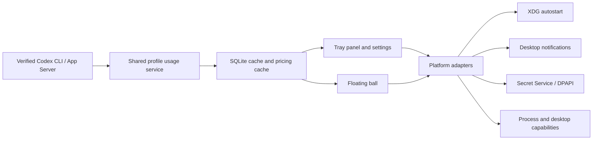

# codex-barbar Ubuntu DEB Design

**Status:** Proposed for user review

**Decision:** Ship a native Ubuntu 24.04 amd64 `.deb` from the existing
Tauri/React/Rust application. Reuse shared product logic and introduce
platform-specific adapters; do not fork a second desktop application.

## 1. Product Goal

`codex-barbar` gains an Ubuntu desktop edition that gives a signed-in Codex
user the same core read-only usage experience as the Windows app:

- a resident system-tray/AppIndicator entry with current weekly quota;
- tray panel, settings, account identity, usage/spend dashboard, and refresh;
- an opt-in animated floating status ball where the compositor permits it;
- start-at-login through the XDG autostart convention;
- desktop notifications through the Freedesktop notification service;
- a reproducible `amd64` Debian package published beside the Windows assets.

The first supported environment is **Ubuntu 24.04 LTS amd64**, with GNOME as
the primary desktop. KDE Plasma is a best-effort compatibility target. The
package is not an Ubuntu repository/apt source and is not GPG-signed in the
first release; GitHub Release SHA-256 sums remain the integrity mechanism.

## 2. Scope and Non-goals

### In scope

1. Native Ubuntu build, install, launch, tray menu, settings window, usage
   refresh, local usage/spend, and `.deb` packaging.
2. Current CLI account discovery through a verified Linux `codex` resolver.
3. Managed-account credentials stored only through the logged-in user's
   Secret Service keyring; no plaintext credential fallback.
4. XDG autostart, Freedesktop notifications, and Linux process discovery for
   float-ball activity state.
5. Linux CI and tag-release jobs that publish one Windows installer set and
   one Ubuntu `.deb` in the same GitHub release.

### Explicitly out of scope for this release

1. A Windows-style taskbar/panel overlay. Linux desktops do not expose a
   portable taskbar placement API, and Wayland intentionally restricts such
   overlays.
2. Flatpak, Snap, RPM, AppImage, ARM64, an apt repository, and automatic
   package updates.
3. Chromium cookie decryption until it is independently verified against the
   desktop keyring. Current CLI/App Server access and Firefox-compatible paths
   remain the supported discovery routes.
4. A silent plaintext fallback for managed credentials, cookies, API keys, or
   refresh tokens.

## 3. User-visible Linux Behavior

| Surface or setting | Ubuntu behavior | Windows behavior |
| --- | --- | --- |
| System tray | Enabled through Tauri's Linux StatusNotifier/AppIndicator support. | Unchanged. |
| Tray panel and settings | Same React surfaces and safe actions. | Unchanged. |
| Taskbar status | Not rendered and not toggleable on Linux. Stored preference is retained so a shared settings file does not lose a Windows choice. | Unchanged Win32 overlay. |
| Floating ball | Opt-in, draggable utility window. It requests always-on-top but never claims click-through, taskbar anchoring, or fullscreen ownership. If the compositor rejects the hint, it remains a normal movable window and the settings UI states that limitation. | Unchanged Windows behavior. |
| Start at login | Creates/removes one XDG `.desktop` file. | Unchanged HKCU Run registration. |
| Notifications | Freedesktop D-Bus notification when a server is available; otherwise settings show unsupported instead of pretending delivery succeeded. | Unchanged Windows toast flow. |
| Managed accounts | Available only while Secret Service is reachable. Otherwise Current CLI remains available and managed-login controls explain why they are disabled. | Unchanged DPAPI vault. |

The Linux settings tab is labelled **Tray & Floating Ball**. It does not show
the Windows taskbar status controls. The existing persisted
`taskbar_status_enabled` value is never rewritten by Linux startup, by a
settings read, or by closing the floating ball.

## 4. Platform Architecture

The shared provider, storage, usage, pricing, React view-model, and safe
action contracts remain common. OS responsibilities move behind narrow,
testable platform boundaries:

### 4.1 Platform capabilities

Add a typed `DesktopPlatformCapabilities` DTO to the desktop bridge. It
contains at least these booleans/statuses:

- `system_tray_available`
- `taskbar_status_available`
- `floating_ball_available`
- `autostart_available`
- `notifications` (`available`, `appDisabled`, `globalDisabled`, or
  `unsupported`)
- `managed_credentials_available`

The backend derives it from `cfg!(target_os)` plus runtime probes. The React
settings surfaces consume this DTO instead of assuming that a Windows control
exists. A capability being unavailable is not a settings-save failure.

### 4.2 Shared platform facade

`rust/src/platform/` becomes a platform-neutral facade with explicit
`windows` and `linux` implementations. The facade owns autostart, system
locale, process inspection, and platform support reporting. Existing Windows
modules keep their current public behavior; Linux callers must not reach into
`platform::windows`.

The desktop shell obtains these services through small constructors rather
than concrete Windows names. In particular, `main.rs`,
`commands/settings.rs`, `tray_bridge.rs`, and notification commands cannot
construct or name Windows-only types directly.

### 4.3 Status surfaces

`TaskbarOverlay` and its measurement window remain compiled only for Windows.
On Linux, `StatusSurfaceKind::TaskbarStatus` maps to an explicit unavailable
runtime that does not create helper windows, retry positioning, or mutate the
stored preference. Float-ball lifecycle remains shared, with a Linux window
backend that uses normal Tauri APIs and does not call DWM, Win32 shape,
no-activate, or taskbar APIs.

Fullscreen suppression is Windows-only in this release. Linux float balls do
not attempt global fullscreen detection because Wayland does not provide a
safe cross-compositor foreground-window API. The user can disable the ball
from settings at any time.

## 5. Linux Credential, Authentication, and Cookie Rules

### 5.1 Secret Service credential protector

Keep the existing `CredentialVault` envelope and generation checks, but add a
Linux `CredentialProtector` implementation backed by the user's Secret
Service. For profile `P`:

1. `protect_current_user(P, plaintext)` writes the credential bundle to a
   Secret Service item whose attributes include the fixed application id,
   vault schema version, and `P`.
2. It returns a non-secret opaque marker containing only the schema version
   and `P`; the marker is what the existing local vault envelope stores.
3. `unprotect_current_user(P, marker)` accepts only the exact marker for `P`
   and reads the secret from the matching keyring item.
4. `CredentialVault::remove(P)` deletes both its local envelope artifacts and
   the matching Secret Service item.

The local envelope therefore retains recovery generation/metadata but never
contains a Linux managed credential. Keyring failure returns a typed secure
store error. The app must disable managed login and explain the condition; it
must not write a plaintext JSON, base64 blob, or fallback password file.

Windows DPAPI envelopes are platform-specific. Linux treats them as
unreadable and asks the user to re-authenticate; it never tries to decrypt
DPAPI bytes or copy them into a Linux secret store.

### 5.2 Current CLI and browser discovery

Linux Current CLI discovery supports a verified absolute `codex` executable
from the saved override or `PATH`, including a verified npm package layout.
It rejects relative overrides, untrusted wrapper layouts, and arbitrary shell
fragments. Child processes use Unix process-group supervision so cancellation
does not orphan the App Server.

Initial automatic browser support is deliberately narrow:

- Firefox-compatible SQLite cookie discovery may be enabled only after a
  deterministic Linux fixture proves it returns no unrelated cookies.
- Chromium automatic cookie import stays unavailable until an audited
  Secret-Service/OSCrypt decryptor exists.
- Manual secrets use the same secure-store policy as managed credentials.

## 6. Notifications, Autostart, and Motion

### 6.1 Notifications

Factor `WindowsToastSink` out of the controller's concrete state type. The
controller receives a platform-selected `ToastSink`:

- Windows continues to use the existing toast sink and capability probe.
- Linux sends via `org.freedesktop.Notifications` on the session D-Bus.

The Linux probe requires a reachable session bus and notification service.
The existing master switch, warning/danger thresholds, deduplication, and
test-notification command remain shared. A missing daemon returns
`unsupported`; it does not report a false successful notification.

### 6.2 XDG autostart

When enabled, Linux writes exactly one user-owned file:

`~/.config/autostart/com.naipi11.codexbarbar.desktop`

Its `Exec` points to the absolute installed/development executable followed by
`--background`. It has a fixed desktop-entry id, no shell interpolation, and
is removed only when the user disables start-at-login. The implementation
validates that the executable is absolute and named `codex-barbar` on Linux.

### 6.3 Activity motion

Linux process inspection reads `/proc` with injectable readers for tests. It
recognizes the verified Codex executable/App Server process tree and the same
Fast-mode configuration signals used on Windows. Permission denial or an
unreadable `/proc` produces idle motion rather than a false busy/fast state.

## 7. Debian Packaging

The Linux build has a dedicated Tauri config overlay and scripts; the Windows
config stays intact.

- Windows command: `pnpm run tauri:build:windows` builds NSIS.
- Linux command: `pnpm run tauri:build:linux` builds only a Debian package.
- Linux output: `codex-barbar_<version>_amd64.deb`.
- Debian metadata: package id `com.naipi11.codexbarbar`, category `Utility`,
  MIT license, GitHub repository URL, application icons, and generated
  desktop entry.

The generated package declares the Tauri runtime dependencies required for
the release target: WebKitGTK 4.1, GTK 3, and the system-tray/AppIndicator
runtime. The Linux overlay adds the Secret Service runtime dependency needed
by the chosen secure-store implementation. CI verifies the final control
metadata rather than relying solely on source configuration.

Ubuntu build jobs install the documented build dependencies: WebKitGTK 4.1
development headers, GTK 3 development headers, Ayatana AppIndicator
development headers, `librsvg2-dev`, `libssl-dev`, `patchelf`, `libfuse2`,
`file`, and normal compiler tooling. CI sets
`TAURI_LINUX_AYATANA_APPINDICATOR=1` so the packaged tray uses the installed
Ayatana runtime consistently.

### Implementation dependency authorization

The approved implementation adds only these Rust dependencies for Linux
services:

- `keyring`, using its Secret Service backend for managed credentials;
- `notify-rust` for Freedesktop D-Bus desktop notifications.

Neither dependency is used as a plaintext credential fallback. No new shell
tool, browser automation dependency, or external background daemon is added.

## 8. CI and Release Design

### Pull-request / main validation

Keep the current Windows job. Add an independent `ubuntu-24.04` job that:

1. installs the Linux build packages;
2. installs stable Rust, Node 20, and pnpm 10.18.1;
3. runs shared Rust tests/clippy and frontend tests/build;
4. compiles the Tauri shell for `x86_64-unknown-linux-gnu`;
5. builds a `.deb` and runs `dpkg-deb --info` and `dpkg-deb --contents`;
6. asserts package name, version, architecture `amd64`, runtime dependency
   fields, desktop entry, icons, executable, and no path traversal entries.

Windows-only PowerShell release scripts are never invoked on the Ubuntu job.

### Tag release

Split the current one-job release workflow into three jobs:

1. **Windows build** creates the existing NSIS installer, portable ZIP, SBOM,
   and Windows manifest.
2. **Ubuntu build** creates the `.deb`, Linux SBOM, Linux manifest, and
   package verification report.
3. **Publish** downloads both artifact groups, verifies each hash and
   manifest, produces one aggregate `SHA256SUMS.txt`, and creates exactly one
   draft GitHub Release containing both platform asset sets.

The Dependabot high/critical gate runs once before publishing. No build job is
allowed to create a release independently, preventing tag-race duplicates.

## 9. Acceptance Criteria

The Ubuntu implementation is ready for a public release only when all of the
following are true:

1. Existing Windows checks and installer behavior remain green.
2. Ubuntu CI builds a valid `.deb` from a clean checkout.
3. On Ubuntu 24.04 GNOME, the installed package launches, exposes a tray
   item, opens the tray panel and settings window, refreshes Current CLI
   quota, and closes to the tray without exiting unexpectedly.
4. XDG autostart file creation/removal is verified in an isolated test home.
5. A real Secret Service session successfully stores/retrieves one test
   profile bundle; an unavailable keyring disables managed login without a
   plaintext write.
6. Linux notification test either displays through the desktop daemon or
   reports a typed unsupported capability.
7. Linux taskbar overlay controls are absent and do not create taskbar or
   measurement windows.
8. Float ball is manually verified on Ubuntu GNOME Wayland and X11; if a
   compositor declines always-on-top, the documented normal movable-window
   fallback is observed.
9. Release asset hashes, Debian metadata, SBOMs, and manifests match the
   tagged source version.

## 10. Risks and Fixed Responses

| Risk | Fixed response |
| --- | --- |
| GNOME lacks an AppIndicator extension | Keep the app functional through its settings/main window and document the extension requirement; do not claim a hidden tray icon is available. |
| Wayland declines global overlay positioning | Use the normal movable float-ball window; never emulate the Windows taskbar overlay. |
| Secret Service is locked or absent | Disable managed credential actions with a typed explanation; never use plaintext fallback. |
| Codex executable cannot be verified | Keep the app open with Current CLI unavailable, retain cached read-only usage, and offer explicit executable validation. |
| Chromium cookie decryption is unsupported | Keep it unavailable rather than reading encrypted data incorrectly. |
| Ubuntu package differs from source metadata | Block the release in `dpkg-deb` verification before the draft release is created. |

## 11. External Build References

- Tauri Debian packaging: <https://v2.tauri.app/distribute/debian/>
- Tauri GitHub pipeline guidance: <https://v2.tauri.app/distribute/pipelines/github/>
- Tauri Linux environment variables: <https://v2.tauri.app/reference/environment-variables/>
