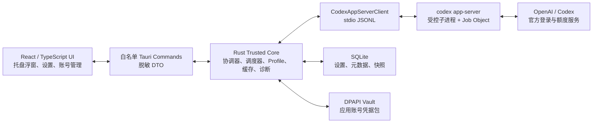
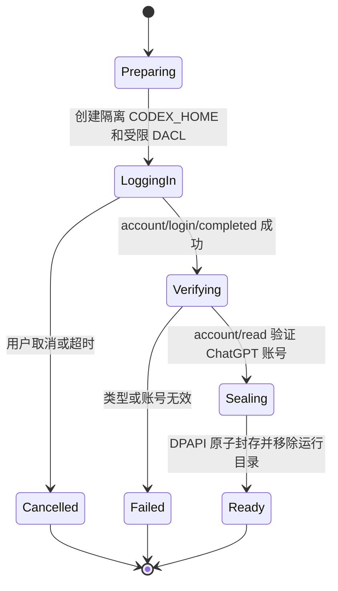

# codex-barbar V1 设计规范

- 状态：已批准（包含 App Server 实验性依赖风险）
- 日期：2026-08-03
- 目标仓库：[naipi11/codex-barbar](https://github.com/naipi11/codex-barbar)
- Windows 基线：[Finesssee/Win-CodexBar](https://github.com/Finesssee/Win-CodexBar)，导入提交 `b167e328147b93f997034a6b50c8b769d2a37f3b`
- 行为参考：[steipete/CodexBar](https://github.com/steipete/CodexBar)

## 1. 决策摘要

`codex-barbar` 是面向 Windows 11 的 Codex 用量托盘应用。V1 只支持 Codex，使用 Win-CodexBar 的 Tauri 2、React/TypeScript 和 Rust 代码作为实现基线，以原版 CodexBar 的术语、交互和数据模型作为行为参考。

V1 的关键决策如下：

- 仅支持 Windows 11 23H2 及以上、x64、原生 Windows 环境。
- 采用单托盘图标；左键打开信息浮窗，右键打开原生命令菜单。
- 默认显示剩余额度，覆盖主要短周期窗口和每周窗口。
- 使用官方文档覆盖、但 CLI 成熟度仍为 experimental 的 `codex app-server`，并把账号/额度方法封装在版本受控的本地 stdio JSONL 适配层中。
- 当前 Codex CLI 账号只作为特殊只读 Profile 使用；应用不会替换、切换、登出或删除它。
- 应用内新增账号使用隔离 `CODEX_HOME`，闲置时凭据包由 Windows DPAPI Current User 加密。
- V1 提供 NSIS 按用户安装包和便携 ZIP，通过 GitHub Releases 发布并支持手动检查更新。
- 默认无遥测，不提供自动更新、Winget、MSIX、Microsoft Store 或其他 AI Provider。

## 2. 背景与目标

原版 CodexBar 是完整的 macOS 应用，其 UI、进程、Keychain、WebKit、浏览器 Cookie 和 PTY 实现与 Windows 不兼容。Win-CodexBar 已经提供可复用的 Windows Tauri 壳、React 界面、Rust Provider 框架、托盘、DPAPI、SQLite、打包和 CI 能力。因此，V1 不移植 Swift 平台层，也不从零重写 Windows 桌面基础设施。

目标用户是已经在 Windows 上使用 Codex CLI、需要频繁查看 ChatGPT Codex 套餐额度，并可能在多个 ChatGPT 账号之间查看额度的人。

V1 要解决的核心问题：

1. 无需打开浏览器或进入 Codex TUI，即可抬眼查看剩余额度和重置时间。
2. 不破坏当前 Codex CLI 登录的前提下，在应用内部安全管理其他账号。
3. 网络、认证或 Codex 版本异常时，仍展示可信的最后成功数据和明确的恢复动作。
4. 形成可以持续同步上游、可测试、可安装、可审计的 Windows 项目基线。

## 3. 产品范围

### 3.1 V1 包含

- Windows 托盘常驻、单实例和开机启动。
- 动态托盘图标、Tooltip、左键信息浮窗和右键原生命令菜单。
- 当前 Codex CLI 账号自动发现。
- 应用管理账号的新增、命名、切换和移除。
- 5 小时/短周期窗口、每周/长周期窗口、重置时间、数据更新时间和错误状态。
- 启动缓存、定时刷新、手动刷新、合并并发刷新和错误退避。
- 中文与英文界面、系统/浅色/深色主题和 Windows 缩放适配。
- 本地设置、SQLite 快照、DPAPI 凭据保险库和脱敏诊断导出。
- NSIS 按用户安装包、便携 ZIP、GitHub Releases 手动检查更新。

### 3.2 V1 不包含

- Claude、Gemini 或任何其他 Provider。
- 修改、替换或备份恢复 CLI 主 `auth.json` 来实现账号切换。
- 浏览器 Cookie 扫描或 WebView 内嵌登录。
- API 费用历史、用量图表、燃尽预测、桌面小组件或额度通知。
- 旧 Win-CodexBar 数据自动迁移。
- 自动下载/安装更新、Winget、MSIX 或 Microsoft Store。
- WSL、Windows on ARM、Windows 10 或 macOS/Linux 构建。
- 云同步、远程账号管理、后台分析服务或遥测。

## 4. 成功标准

V1 达到发布条件时必须满足：

- 在干净的 Windows 11 23H2+ x64 用户环境中按用户安装，无需管理员权限。
- 有缓存时，从启动到托盘可用和缓存可见不超过 3 秒。
- 支持单实例、开机启动、安装卸载和便携启动。
- 能发现当前 Codex 登录，并在文件凭据与 Windows 凭据存储两种模式下通过官方 App Server 工作。
- 能新增和切换应用账号，且不调用 CLI Profile 的登录、登出或账号切换方法。
- 能展示短周期和长周期额度、重置时间、新鲜度及错误状态。
- 断网或瞬时失败时保留最后成功快照；恢复后自动刷新。
- 所有应用账号凭据闲置时均为 DPAPI 密文，日志和前端数据中不存在令牌。
- 安装包与便携 ZIP 均通过真实 Windows 桌面验收。

## 5. 用户体验规范

### 5.1 托盘图标

- 图标中的数字表示当前账号所有可用额度窗口中最低的 `remainingPercent`。
- `remainingPercent > 50` 使用正常色；`20 < remainingPercent <= 50` 使用警示色；`remainingPercent <= 20` 使用危险色。
- 缓存超过新鲜度阈值时使用灰色；无有效数据或认证失败时显示警告标记。
- 颜色不是唯一信息载体；Tooltip 必须同时写明账号、剩余百分比、更新时间和状态。
- 没有适用额度的 API Key 账号显示 `API`，不得显示伪造的百分比。

### 5.2 左键信息浮窗

浮窗按以下顺序显示：

1. 当前账号名称、可选邮箱、套餐和账号选择器。
2. 短周期额度卡：剩余百分比、进度条、窗口长度和本地化重置倒计时。
3. 长周期额度卡：剩余百分比、进度条、窗口长度和本地化重置倒计时。
4. 数据更新时间、缓存/刷新/错误状态。
5. 刷新、打开官方用量页面和设置入口。

账号切换后立即显示目标账号的缓存，再在后台刷新。浮窗必须限制在当前显示器工作区内，并正确处理任务栏位于屏幕四边、多显示器、100%–200% 缩放和 Windows 动画关闭的情况。

键盘行为：`Tab` 移动焦点，`Enter`/`Space` 激活控件，`Escape` 关闭浮窗。所有百分比、进度条和错误必须有可供屏幕阅读器读取的标签。

### 5.3 右键托盘菜单

V1 菜单顺序：

1. 打开 codex-barbar
2. 立即刷新
3. 账号子菜单
4. 打开 Codex 用量页面
5. 设置
6. 关于
7. 退出

退出必须停止调度器、封存活动的应用账号、终止 App Server Job Object，并在有界超时后强制退出。

### 5.4 设置

V1 设置项：

- 开机启动，默认关闭。
- 刷新间隔：1、5、15、30 分钟或关闭；默认 5 分钟。
- 显示模式：剩余或已使用；默认剩余。托盘危险阈值始终按剩余量计算。
- 主题：跟随系统、浅色、深色；默认跟随系统。
- 语言：跟随系统、简体中文、英文；默认跟随系统。
- Codex 可执行文件路径：自动发现，并允许用户显式覆盖。
- 账号管理、诊断导出和手动检查更新。

## 6. 总体架构



### 6.1 React/TypeScript 展示层

展示层只接收脱敏 DTO，负责布局、交互、本地化和可访问性。它不得获得 OAuth 访问令牌、刷新令牌、原始 `auth.json`、任意文件系统能力、任意 Shell 能力或任意网络能力。

### 6.2 Rust 可信核心

目标组件：

- `AppCoordinator`：单实例、窗口和托盘生命周期。
- `RefreshScheduler`：定时器、并发合并、超时、退避和刷新事件。
- `CodexAppServerClient`：子进程、初始化、RPC 关联、通知和能力探测。
- `AccountProfileService`：CLI Profile 与应用 Profile 的生命周期。
- `CredentialVault`：DPAPI 封存、解封、原子替换和恢复。
- `UsageRepository`：SQLite 设置、账号元数据和快照。
- `Diagnostics`：结构化错误、脱敏、滚动日志和诊断导出。

保留 Win-CodexBar 的通用 `Provider` 抽象以降低改造风险，但 V1 运行时只能注册 Codex。其他 Provider 模块、权限、设置入口和资源不进入发布路径。

现有 `AppState.provider_cache` 是按 Provider 保存的进程内缓存，不能直接承担多账号语义。目标缓存键必须至少包含 `(profile_id, provider_id)`，最后成功快照持久化到 SQLite；内存层只作为该持久缓存的热缓存。

### 6.3 平台边界

- Tauri 2 提供窗口、托盘、单实例和启动能力。
- Windows API 提供 DPAPI、DACL、Job Object、原生路径和启动项能力。
- SQLite 保存非秘密数据。
- `codex app-server` 是账号和额度的唯一线上集成面；它是实验性外部依赖，所有影响必须被限制在适配层内。
- V1 不直接调用未公开的 Codex 用量端点。

## 7. Codex App Server 集成

Codex CLI 参考将 `codex app-server` 整体标记为 **experimental**，说明它主要用于开发/调试且可能无通知变化。账号方法已有官方文档，并且本规范不启用 `experimentalApi`，但这不等于进程命令或协议获得稳定性承诺。V1 接受该风险的前提是：隔离适配层、能力探测、已测试版本矩阵、宽容解析和明确的兼容失败界面。不得把 App Server 描述为稳定公共 API。

### 7.1 可执行文件发现

发现顺序：

1. 用户设置的绝对路径。
2. 当前进程环境中的 `PATH`/`PATHEXT`，但不得让当前工作目录优先。
3. 已知的原生 Windows 安装位置；该列表必须由测试覆盖。

所有候选路径必须规范化为绝对路径，确认是普通文件且不是不受信任的相对路径。应用使用 Rust 进程 API直接启动 `codex.exe`，不得经过 `cmd.exe`、PowerShell 或字符串拼接的 Shell 命令。诊断页显示选中的路径与 `codex --version`，但不显示敏感环境变量。

若 Windows 安装只暴露 `codex.cmd`，不得直接执行任意批处理。实现必须验证是否能够安全解析官方包装器并直接启动规范化的运行时与入口文件；不能验证时显示“不支持此 Codex 安装形式”，引导用户安装原生可执行版本。该兼容性必须在 M1 实机验证，不能以放宽 Shell 边界解决。

### 7.2 传输与生命周期

- 仅使用 `codex app-server` 默认 stdio JSONL；不使用实验性 WebSocket。
- 子进程 stdin/stdout 使用管道，stderr 进入脱敏诊断适配器。
- 使用 `CREATE_NO_WINDOW`；持续排空 stdout 与 stderr，避免管道阻塞。
- 子进程加入 Windows Job Object，并启用主进程关闭时终止整个进程树。
- 初始化超时 10 秒，单次 RPC 超时 20 秒，完整刷新预算 30 秒。
- 每次最多激活一个账号 Profile 和一个 App Server 子进程。
- 请求 ID 单调递增；未知通知被忽略并记录计数，不记录原始正文。
- 成功响应 `initialize` 后必须发送 `initialized` 通知；请求 ID、响应和取消状态严格关联。
- 单条 JSONL 设置 1 MiB 上限；解析器忽略未知字段，对超大行、无效 JSON 或必需字段缺失返回版本/协议错误。
- 正常关闭先关闭 stdin 并有界等待 3 秒；超时后通过 Job Object 终止进程树。

### 7.3 能力探测

应用不硬编码未经验证的最低 Codex 版本。启动时完成 `initialize`，保持 `experimentalApi` 关闭，然后通过实际请求验证以下方法是否可用：

- `account/read`
- `account/login/start`（仅应用账号登录需要）
- `account/login/cancel`
- `account/rateLimits/read`

若当前 Codex 版本不支持读取账号或额度，显示“此 Codex 版本与 codex-barbar 不兼容”，并区分建议升级、降级或安装已测试版本，保留缓存且不进入无限重试。CI 维护已测试 Codex 版本矩阵；实现阶段应使用 `codex app-server generate-json-schema` 生成匹配版本的测试参考，但生成物不得替代宽容解析策略。

### 7.4 RPC 使用边界

当前 CLI Profile 只允许：

- `initialize` / `initialized`
- `account/read`
- `account/rateLimits/read`

该限制必须在 Rust 类型/服务边界实施，而不只是隐藏 UI：`CurrentCliSession` 不暴露登录、登出、删除或配置写入方法。不得对当前 CLI Profile 调用 `account/login/start`、`account/login/cancel` 或 `account/logout`。官方 App Server 可能在正常工作时刷新自己的令牌缓存；这是允许的官方凭据维护，但 codex-barbar 不得自行替换、选择或删除 CLI 凭据。

应用 Profile 可以使用：

- `account/login/start`，优先 `chatgpt` 浏览器流程。
- `chatgptDeviceCode` 作为浏览器回调失败时的备用流程。
- `account/login/cancel` 取消未完成登录。
- `account/read` 验证登录结果。
- `account/rateLimits/read` 读取额度。

V1 不使用实验性的 `chatgptAuthTokens`，也不接受 API Key 作为新增应用账号。

## 8. 多账号模型

### 8.1 Profile 类型

`AccountProfile` 分为：

- `CurrentCli`：唯一、不可删除，指向用户当前有效 `CODEX_HOME`。
- `Managed`：由 codex-barbar 创建和管理，拥有独立的隔离 `CODEX_HOME` 和 DPAPI 凭据包。

建议字段：

```text
AccountProfile {
  id: UUID,
  kind: CurrentCli | Managed,
  label: String,
  email: Option<String>,
  plan_type: Option<String>,
  auth_mode: Unknown | ChatGpt | ApiKey,
  created_at: Timestamp,
  last_selected_at: Option<Timestamp>,
  last_success_at: Option<Timestamp>
}
```

SQLite 只存不敏感的 Profile 元数据。邮箱属于个人信息，默认放入 DPAPI Profile 元数据包；SQLite 可以保存用户自定义标签和不可逆的去重指纹。

### 8.2 新增应用账号



流程要求：

1. 生成随机 Profile ID 和随机运行目录。
2. 为运行目录设置仅当前 Windows 用户与系统账号可访问的 DACL，并拒绝重解析点。
3. 写入最小隔离配置，强制 `cli_auth_credentials_store = "file"`。若无法确认该配置生效，则中止登录；Managed Profile 不得使用 Keyring，以免不同 `CODEX_HOME` 共享或覆盖 CLI 主凭据。
4. 只为该子进程设置 `CODEX_HOME`，并移除 `OPENAI_API_KEY`、`CODEX_API_KEY`、`CODEX_ACCESS_TOKEN` 等会覆盖 Profile 认证的变量；不得修改主进程全局环境。
5. 启动 App Server，执行官方浏览器登录；必要时切换设备码登录。
6. 用 `account/read` 验证账号类型、邮箱和套餐。
7. 停止子进程，验证凭据文件结构与 Profile 一致性。
8. 使用 DPAPI Current User 封存整个凭据包，写临时密文并原子替换正式 Vault 文件。
9. 删除运行目录并提交 SQLite 元数据事务。

若邮箱与现有 Profile 相同，默认阻止重复导入并允许用户选择已有 Profile。邮箱缺失时允许继续，但要求唯一标签。

### 8.3 激活、切换和移除

- 切换账号只修改 codex-barbar 的 `selected_profile_id`。
- 切换后立即显示目标账号缓存，然后顺序停止旧子进程、封存旧 Profile、解封新 Profile并刷新。
- 应用 Profile 运行期间，明文凭据只存在于受限运行目录；停用、退出或刷新完成后立即重新封存并删除运行目录。
- 移除应用 Profile 必须要求确认，并删除其 Vault 密文、运行残留、账号元数据和快照。
- 当前 CLI Profile 不显示移除或登出操作。
- 卸载器默认保留用户数据，并提供显式“删除本地账号与缓存”选项。

### 8.4 崩溃恢复

运行目录包含不含令牌的恢复清单：Profile ID、Vault 版本、创建时间和状态。下次启动时：

1. 拒绝目录外路径、链接和重解析点。
2. 若运行凭据结构完整且比 Vault 新，则先生成新的 DPAPI 密文并原子替换 Vault。
3. 若校验失败，保留上一个有效 Vault，不覆盖它。
4. 删除运行目录并记录脱敏恢复结果。

不承诺在 SSD 上实现物理安全擦除；安全目标是最小化明文存续窗口、限制 ACL，并保证闲置状态只有 DPAPI 密文。

## 9. 用量数据模型

```text
UsageWindow {
  limit_id: String,
  label: Option<String>,
  used_percent: f64,          // 规范化为 0..100
  remaining_percent: f64,     // 100 - used_percent
  window_duration_minutes: Option<u64>,
  resets_at: Option<Timestamp>,
  reached_type: Option<String>
}

UsageSnapshot {
  profile_id: UUID,
  plan_type: Option<String>,
  primary: Option<UsageWindow>,
  secondary: Option<UsageWindow>,
  additional_windows: Vec<UsageWindow>,
  fetched_at: Timestamp,
  source: AppServer,
  protocol_anomaly: bool
}
```

规则：

- `usedPercent` 必须有限；超出范围时为显示值做 0–100 截断，并设置 `protocol_anomaly`。
- `remainingPercent` 由规范化后的已使用比例计算，不信任第二来源的重复字段。
- `resetsAt` 按 Unix 秒解析，展示时转为用户本地时区。
- 优先选择 `rateLimitsByLimitId["codex"]`，不存在时回退到兼容字段 `rateLimits`；不得假设对象枚举顺序。
- 在所选 Codex bucket 内读取 `primary` 和 `secondary`；依据 `windowDurationMins` 动态命名。已知 300 分钟与 10080 分钟窗口分别本地化为“5 小时”和“每周”，未知窗口使用官方名称或格式化时长。
- 额外 limit bucket 和未知窗口完整保留在模型中，但 V1 主界面只展示当前 Codex bucket 的主、次窗口。
- 已经过期的 `resetsAt` 不显示负倒计时；标记为待刷新，并保留最后成功数据。
- API Key 账号没有 ChatGPT 套餐额度时返回明确的 `ApiKeyNoQuota` 状态，而不是空的成功快照。

## 10. 启动与刷新策略

### 10.1 启动

1. 获取单实例锁并初始化日志。
2. 打开 SQLite，执行事务化迁移。
3. 恢复并清理受限运行目录。
4. 读取设置、Profile 和最后成功快照。
5. 创建托盘并立即展示缓存。
6. 探测 Codex 路径与版本。
7. 在后台刷新当前所选 Profile。

### 10.2 刷新触发

- 启动后后台刷新。
- 默认每 5 分钟刷新当前所选 Profile。
- 打开浮窗且快照超过 60 秒时触发一次刷新。
- 用户点击立即刷新。
- 切换账号后刷新目标 Profile。

每个 Profile 同一时间只允许一个刷新；重复触发合并为当前任务。手动刷新最短冷却 15 秒。V1 不自动轮询所有未选中账号，以减少凭据解封时间和子进程开销；账号选择器显示各账号最后缓存及更新时间。

### 10.3 新鲜度与退避

- 快照年龄不超过配置刷新间隔的两倍时为正常。
- 超过 `max(2 × refresh_interval, 10 分钟)` 时标记陈旧并将托盘图标置灰。
- 陈旧快照仍可展示，但必须同时显示最后更新时间和当前错误。
- 瞬时错误退避序列：30 秒、2 分钟、5 分钟、15 分钟，加入 ±20% 抖动。
- 成功后清零退避。
- 认证、版本不兼容、Vault 损坏和数据库错误不自动无限重试，等待用户动作。
- 手动刷新可以绕过一次退避，但不能绕过 15 秒冷却。

## 11. 本地存储

所有版本，包括便携 ZIP，默认使用 `%LOCALAPPDATA%\codex-barbar\`：

```text
%LOCALAPPDATA%\codex-barbar\
  data\codex-barbar.db
  vault\<profile-id>.dpapi
  runtime\<random-session-id>\
  logs\codex-barbar.log*
```

“便携”仅表示无需安装，不表示数据跟随 ZIP 目录移动。这样可以避免把账号凭据写入下载目录、共享盘或移动存储。

SQLite 建议表：

- `schema_meta`
- `settings`
- `account_profiles`
- `usage_snapshots`

数据库使用事务和 WAL。迁移前创建有界备份；迁移失败时保留原文件并进入只读错误界面，不自动重建覆盖用户数据。

日志按大小滚动并最多保留 14 天。默认日志级别为 `info`，诊断模式按会话临时启用，重启后恢复默认。

## 12. 安全与隐私

### 12.1 保护资产

- ChatGPT OAuth 访问和刷新凭据。
- 账号邮箱、套餐和账号关联信息。
- 用量快照、设置和诊断信息。
- App Server 子进程和可执行文件选择。

### 12.2 信任边界

- React WebView 视为低权限展示层。
- Rust 核心、Windows API 适配器和受控 App Server 子进程属于可信边界。
- 网络和 GitHub/OpenAI 响应属于外部输入，必须验证。
- 用户可写目录、PATH、符号链接和重解析点不默认可信。

### 12.3 凭据保护

- DPAPI 使用 Current User 范围和禁止 UI 的模式；任何额外 entropy 都不能被当作独立密钥。
- V1 的 Vault 必须“严格失败”：Current User DPAPI 失败时返回 `VaultFailure`，不得回退到 Local Machine 范围或明文文件。
- 密文写入采用“临时文件 → flush → 原子替换”，不得原地覆盖唯一有效副本。
- Rust 中的明文缓冲在使用后尽快清零；不得传入前端、日志、panic 文本或命令行。
- 当前 CLI 凭据不复制进 codex-barbar Vault。
- 不在数据库中保存令牌、Cookie 或原始 `auth.json`。

### 12.4 Tauri 与进程安全

- Capabilities 只允许明确列出的 Tauri Commands。
- 不向前端开放通用 Shell、任意文件读取、任意 HTTP 或进程启动插件权限。
- App Server 参数由固定枚举生成；UI 字符串不能成为命令行参数。
- 子进程继承最小必要环境；`CODEX_HOME` 只传递规范化路径。
- 退出和超时通过 Job Object 清理进程树。
- 生产 CSP 移除 App Server 不需要的 localhost HTTP/WebSocket 来源；App Server 只使用 Rust 侧 stdio。

### 12.5 日志脱敏

以下键名及其大小写/命名变体必须递归脱敏：`token`、`access_token`、`refresh_token`、`authorization`、`cookie`、`api_key`、`auth_json`。不得记录原始 RPC 行、JWT、完整 Vault 内容或用户提供的凭据文件。

诊断导出只包含版本、能力、错误分类、脱敏路径、刷新时间和测试摘要，并在导出前再次扫描高熵字符串及 JWT 形态。

### 12.6 威胁模型边界

设计目标是防止普通文件泄漏、日志泄漏、前端越权、命令注入和异常退出造成的长期明文残留。它不承诺抵御已经控制当前 Windows 用户、能够读取其进程内存，或拥有管理员/内核权限的恶意软件。

## 13. 错误模型与用户动作

| 错误 | 自动重试 | 保留缓存 | 用户动作 |
|---|---:|---:|---|
| `CodexNotFound` | 否 | 是 | 安装 Codex 或选择可执行文件 |
| `UnsupportedCodexVersion` | 否 | 是 | 升级 Codex CLI |
| `NotSignedIn` | 否 | 是 | 在 Codex 登录或新增应用账号 |
| `ApiKeyNoQuota` | 否 | 不适用 | 说明 API 计费与套餐额度不同 |
| `AuthExpired` | 一次官方刷新后停止 | 是 | 重新登录相应 Profile |
| `OfflineOrTimeout` | 是 | 是 | 检查网络，允许手动重试 |
| `RateLimited` | 按服务器信息或退避 | 是 | 等待后重试 |
| `ProtocolMismatch` | 否 | 是 | 升级 Codex 或 codex-barbar |
| `VaultFailure` | 否 | 是 | 重新登录应用账号；不覆盖有效 Vault |
| `StorageFailure` | 否 | 是/只读 | 检查磁盘与权限，导出诊断 |

用户界面必须展示简短说明、最后成功更新时间和一个可执行的下一步。详细错误只在诊断页展示，并保持脱敏。

## 14. 代码库迁移与复用

### 14.1 Git 历史与远端

- `origin`：`https://github.com/naipi11/codex-barbar.git`
- `win-upstream`：`https://github.com/Finesssee/Win-CodexBar.git`
- `mac-reference`：`https://github.com/steipete/CodexBar.git`
- 导入基线标签：`upstream/win-codexbar-2026-08-03`

保留 Win-CodexBar 的完整历史、MIT License 和作者信息。新增 `UPSTREAMS.md` 记录两个来源、基线提交、复用范围和许可证。不得对上游仓库创建 Issue 或 PR，除非用户明确要求。

### 14.2 复用

优先复用：

- `apps/desktop-tauri` 的 Tauri 壳、窗口路由、托盘和 React 基础设施。
- `rust` 中的 Provider 抽象、用量窗口模型、刷新协调、托盘图标渲染、DPAPI/安全文件和设置设施。
- 现有 Vitest、Rust 测试、Windows CI、证明模式和 CUA 验收流程。

### 14.3 改造

- Provider 工厂改为 V1 只注册 Codex。
- `rust/src/providers/codex/api.rs` 当前直接读取 `auth.json` 并调用 `/wham/*` 私有端点；该线上路径必须替换为 App Server stdio 客户端。可复用的纯解析样例可以迁入夹具，但私有请求代码不得留作发布回退。
- `apps/desktop-tauri/src-tauri/src/state.rs` 当前按 Provider 保存内存缓存；改为按 Profile 隔离，并增加 SQLite 最后成功快照。
- 最后成功快照与当前刷新错误必须是两个独立字段；不得沿用以“100% remaining”伪造错误快照的兼容行为。
- 现有 `secure_file` 的 DPAPI 逻辑允许从 Current User 回退到 Machine 范围，且部分写入不是原子替换；应用账号 Vault 必须使用严格 Current User、原子写的新边界，不能继承该回退语义。
- 设置界面移除多 Provider、Cookie 和无关 Provider 的密钥入口。
- 账号存储改为 `CurrentCli` + DPAPI `Managed` Profile。
- 产品名称、包标识、可执行文件、路径、启动项和发布链接全部改为 codex-barbar。
- `apps/desktop-tauri/src/App.tsx` 当前会在启动后自动检查并可能下载更新；V1 移除启动检查、下载与应用更新路径，只保留用户主动触发的版本检查和打开 GitHub Release 页面。
- 当前发布脚本使用 Inno Setup 并输出 portable EXE；V1 改为 Tauri NSIS 按用户安装包，并把独立可执行文件及必要资源封装为 portable ZIP。
- `tauri.conf.json`、Capabilities 和命令注册移除 FloatBar、PopOut、浏览器 Cookie、通用外链/任意路径打开、全局快捷键以及其他 Provider 所需权限；生产 CSP 不保留 localhost 网络例外。
- 新仓库若没有 Blacksmith Runner 权限，CI 改用可用的官方 Windows Runner；不能原样复制一个永远无法调度的上游门禁。

### 14.4 发布中移除或禁用

- 其他 Provider 注册、菜单项、资源和运行权限。
- 浏览器 Cookie 读取能力。
- 旧 Inno Setup、portable EXE、自动下载/应用更新与 Winget 发布路径。
- FloatBar、PopOut Dashboard、Agent Sessions、Workspaces/费用扫描、PTY、浏览器 Cookie、通用 token/API key 账号和任意外部 URL/路径命令。
- 旧产品遥测或外部网络能力（如存在）。
- 旧 CLI 二进制不进入 V1 发布包；内部 Rust crate 名称可以分阶段迁移。

建议标识：

- 产品名：`codex-barbar`
- 桌面可执行文件：`codex-barbar.exe`
- Tauri 标识：`com.naipi11.codexbarbar`
- AppUserModelID：`com.naipi11.codexbarbar`
- 数据目录：`%LOCALAPPDATA%\codex-barbar`
- 启动项名称：`codex-barbar`

## 15. 测试策略

### 15.1 Rust 单元测试

- `account/read` 与 `account/rateLimits/read` 正常、缺失、额外字段和异常数值夹具。
- 已使用/剩余换算、窗口映射、时间与本地化输入。
- 刷新合并、冷却、退避、抖动和取消。
- DPAPI 往返、错误密文、原子替换和崩溃恢复。
- 在解封、启动、刷新、封存和原子替换阶段注入崩溃，验证始终保留至少一个有效 Vault，并清理未提交的新账号暂存。
- 路径规范化、PATH 劫持防护、重解析点拒绝和 Job Object 清理。
- SQLite 迁移、回滚和缓存读取。
- 递归日志脱敏与诊断导出扫描。

### 15.2 进程契约测试

使用可控的假 App Server 子进程覆盖：

- 初始化与正常响应。
- 通知和响应交错、未知通知、乱序响应。
- 无效 JSON、截断输出、超大行和字段变更。
- 启动超时、RPC 超时、子进程崩溃和拒绝退出。
- 登录成功、取消、失败和设备码备用流程。
- 当前 CLI Profile 禁止写方法的断言。
- 两个 Managed Profile 的子进程环境、`CODEX_HOME` 和凭据目录完全隔离，并清除了认证覆盖变量。

真实 Codex App Server 的自动化 smoke test只验证未登录状态、初始化和能力；真实 ChatGPT 账号验收在本地 Windows 环境完成，凭据不得进入 CI。

### 15.3 React 测试

- 托盘浮窗所有数据状态、错误状态和缓存状态。
- 账号选择、切换中、登录向导和移除确认。
- 中英文、时区、长文本、200% 缩放布局。
- 键盘操作、焦点恢复和可访问名称。
- Tauri bridge DTO 与 Rust 序列化契约一致。

### 15.4 Windows 桌面验收

UI、托盘、DWM、WebView2、任务栏位置和多显示器行为必须使用真实 Windows 构建验证。遵循仓库 `AGENTS.md` 的 CUA Driver 证明流程；每次 UI 变更都先重新构建并关闭旧单实例，再采集可观察结果或截图。

验收矩阵：

- 未安装 Codex。
- Codex 版本缺少所需能力。
- 未登录。
- ChatGPT 文件凭据。
- ChatGPT Windows 凭据存储。
- API Key 登录。
- 浏览器登录与设备码登录。
- 多账号切换与移除。
- 断网、超时、限流和恢复。
- App Server 崩溃、应用崩溃和下次启动恢复。
- NSIS 安装、升级、卸载和便携 ZIP。
- Windows 11 23H2 x64 兼容性基线与发布时仍受微软支持的当前 Windows 11 x64 版本。兼容性声明不延长微软的系统支持生命周期。

## 16. CI 与发布

### 16.1 CI 门禁

GitHub Actions Windows Runner 执行：

- `cargo fmt --check`
- 两个 Rust manifest 的 Clippy，`-D warnings`
- 两个 Rust manifest 的测试
- 前端 Vitest、类型检查和生产构建
- 依赖与许可证审计
- Tauri x64 生产构建
- 安装包结构、文件名、版本和哈希检查

遵循仓库约束使用 pnpm 10.18.1、Node 20、Rust stable edition 2024 和 `x86_64-pc-windows-msvc`。实现时不得擅自引入新依赖；若现有能力不足，应先提出依赖变更和理由。

### 16.2 发布物

- `codex-barbar_<version>_x64-setup.exe`
- `codex-barbar_<version>_x64-portable.zip`
- `SHA256SUMS.txt`
- SBOM
- 源码、MIT License、`UPSTREAMS.md`、中英文 README 和发布说明

Alpha/Beta 可以未签名，但必须提供 SHA-256 并说明 SmartScreen 行为。公开 V1 若尚无 Authenticode 证书，应明确标记为未签名社区构建；证书采购是外部发布条件，不阻塞代码完成。

V1 的“检查更新”只读取 GitHub Releases 最新版本信息并打开发布页，不下载或执行二进制。自动更新和 Winget 延后到 V1.1。

GitHub Release API 的匿名检查只在仓库或 Release feed 可公开访问时启用。仓库保持私有期间，应用不得嵌入 PAT，也不得要求用户把 GitHub 凭据交给应用；此时“检查更新”退化为打开固定 Releases 页面或明确显示该功能暂不可用。Actions 只使用仓库提供的短期 `GITHUB_TOKEN`。

## 17. 里程碑

1. **M0：基线与品牌**
   保留上游历史、建立基线标签、配置远端、完成品牌/标识/路径迁移和只支持 Codex 的构建基线。

2. **M1：App Server 核心**
   完成可执行发现、stdio 客户端、能力探测、账号读取、额度解析、错误模型和假服务器契约测试。

3. **M2：账号保险库**
   完成 CurrentCli Profile、Managed Profile、官方登录、DPAPI、受限运行目录、切换、移除和崩溃恢复。

4. **M3：托盘产品界面**
   完成动态图标、左键浮窗、右键菜单、账号管理、设置、本地化、缓存和可访问性。

5. **M4：Windows 集成与加固**
   完成单实例、开机启动、Job Object、路径安全、日志脱敏、诊断导出和真实 Windows CUA 验收。

6. **M5：打包与 RC**
   完成 NSIS、便携 ZIP、CI、SBOM、文档、干净系统验收和候选版修复。

7. **M6：V1 发布**
   生成最终哈希和发布说明，完成来源/许可证审计并发布 GitHub Release。

## 18. 发布完成定义

- 产品范围和非目标没有被无意扩张。
- 所有硬性成功标准均有自动化测试或记录的 Windows 验收证据。
- 当前 CLI Profile 没有任何登录、登出、切换或删除调用路径。
- 应用账号闲置时没有明文凭据，诊断包通过秘密扫描。
- 所有网络数据通过官方 App Server 或 GitHub Releases 检查路径产生。
- 启动路径不会检查、下载或执行更新；只有用户主动检查版本时访问 GitHub Releases。
- 其他 Provider 不可从发布 UI、配置或运行时注册表启用。
- 安装包和便携 ZIP 在 Windows 11 23H2+ x64 干净环境通过测试。
- README、隐私说明、故障排查、许可证和上游来源完整。
- Git 工作树干净，CI 通过，发布提交和产物可追溯。

## 19. 风险与缓解

| 风险 | 缓解 |
|---|---|
| App Server 命令是 experimental 且可能无通知变化 | 单一适配层、关闭 experimentalApi、能力探测、宽容解析、假服务器契约测试、已测试版本矩阵、兼容失败 UX |
| 多账号需要短暂明文运行目录 | Current User DACL、随机目录、单 Profile 激活、尽快封存、启动恢复 |
| 当前 CLI 使用 Keyring 而非文件 | 通过官方 App Server 访问，不自行猜测 Keyring 格式 |
| PATH 劫持或恶意 `codex.exe` | 绝对路径规范化、禁止工作目录优先、显示实际路径、固定参数 |
| Tauri 前端获得过多权限 | 白名单 Commands、最小 Capabilities、无通用 Shell/文件/网络 |
| 从多 Provider 基线收窄造成回归 | 分阶段禁用、保留通用接口、测试后移除、保留完整 Git 历史 |
| 未签名安装包触发 SmartScreen | Alpha/Beta 明示、发布哈希、后续 Authenticode，不伪装已签名状态 |

## 20. 外部依赖与待验证项

以下不是未决产品选择，但必须在实现阶段验证并记录：

- 首个支持所需账号/额度 RPC 的 Codex CLI 版本和当前稳定版本。
- 每个计划发布版本实际兼容的 Codex CLI 版本范围；App Server 仍为 experimental 时不得声称全版本兼容。
- Windows Keyring 模式下 `CurrentCli` Profile 的真实 App Server 行为。
- 隔离 `CODEX_HOME` 登录后产生的文件集合和令牌刷新写回时机。
- 现有 Win-CodexBar DPAPI、SQLite、托盘和启动模块是否可直接满足本规范，避免不必要的新依赖。
- Authenticode 证书是否可用于公开 V1。

若验证结果与本规范的安全不变量冲突，应回到设计评审，不得以隐藏兼容逻辑绕过。

## 21. 参考资料

- [Codex App Server](https://learn.chatgpt.com/docs/app-server.md)
- [Codex CLI command reference](https://learn.chatgpt.com/docs/developer-commands?surface=cli#cli-codex-app-server)
- [Codex authentication](https://learn.chatgpt.com/docs/auth.md)
- [Tauri 2 system tray](https://v2.tauri.app/learn/system-tray/)
- [Tauri Windows installer](https://v2.tauri.app/distribute/windows-installer/)
- [Tauri capabilities](https://v2.tauri.app/security/capabilities/)
- [Windows DPAPI `CryptProtectData`](https://learn.microsoft.com/en-us/windows/win32/api/dpapi/nf-dpapi-cryptprotectdata)
- [Windows `Shell_NotifyIcon`](https://learn.microsoft.com/en-us/windows/win32/api/shellapi/nf-shellapi-shell_notifyicona)
